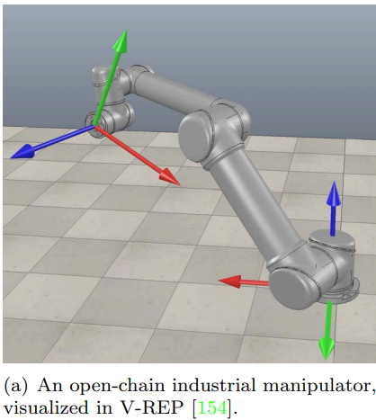
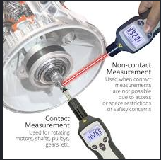

>As an academic discipline, robotics is a relatively young field with highly ambitious goals, the ultimate one being the creation of machines that can behave
and think like humans. This attempt to create intelligent machines naturally
leads us first to examine ourselves – to ask, for example, why our bodies are
designed the way they are, how our limbs are coordinated, and how we learn and
perform complex tasks. The sense that the fundamental questions in robotics
are ultimately questions about ourselves is part of what makes robotics such a
fascinating and engaging endeavor.

>[Sundeep:] Honestly speaking, This first part of the chapter just feels as if every word written here is important and as brief as possible and hence I would seriously urge you to just go and read this part from [the book](https://hades.mech.northwestern.edu/images/7/7f/MR.pdf)(page 2 i.e page 20 in chrome). The best I can do to contribute is shorten a few words or format it slightly or explain some unseen words like resolvers and tachometers

## Links and joints

 any mechanism is constructed by connecting **rigid bodies, called links**, together by means of joints,
so that relative motion between adjacent links becomes possible. Actuation of
the joints, typically by electric motors, then causes the robot to move and exert
forces in desired ways

The links of a robot mechanism can be arranged in serial fashion

OR in closed loops as well--

" In the case of an open chain, all the joints may be actuated,  while
in the case of mechanisms with closed loops, only a subset of the joints may be
actuated."

## Backlash

Electric motors(used in actuators-- to move joints), would ideally be lightweight, operate at relatively low rotational speeds (e.g., in the range of hundreds of RPM), and be able to generate
large forces and torques. Since most currently available motors operate at low
torques and at up to thousands of RPM, speed reduction and torque amplification are required. Examples of such transmissions or transformers include
gears, cable drives, belts and pulleys, and chains and sprockets.

 These speedreduction devices should have zero or low slippage and backlash (defined as
the amount of rotation available at the output of the speed-reduction device
without motion at the input).

## sensors to measure the motion at the joints

For both revolute and prismatic joints, `encoders, potentiometers, or resolvers`*(used to measure angular position and velocity in motors and drive systems)*
measure the displacement and sometimes `tachometers `*(an instrument that measures the rotational speed of a shaft or disk, typically displaying it in revolutions per minute (RPM)*)are used to measure velocity.

 Forces and torques at the joints or at the end-effector of the robot can be
measured using various types of force–torque sensors. Additional sensors may
be used to help localize objects or the robot itself, such as vision-only cameras,
RGB-D cameras which measure the color (RGB) and depth (D) to each pixel,
laser range finders, and various types of acoustic sensor