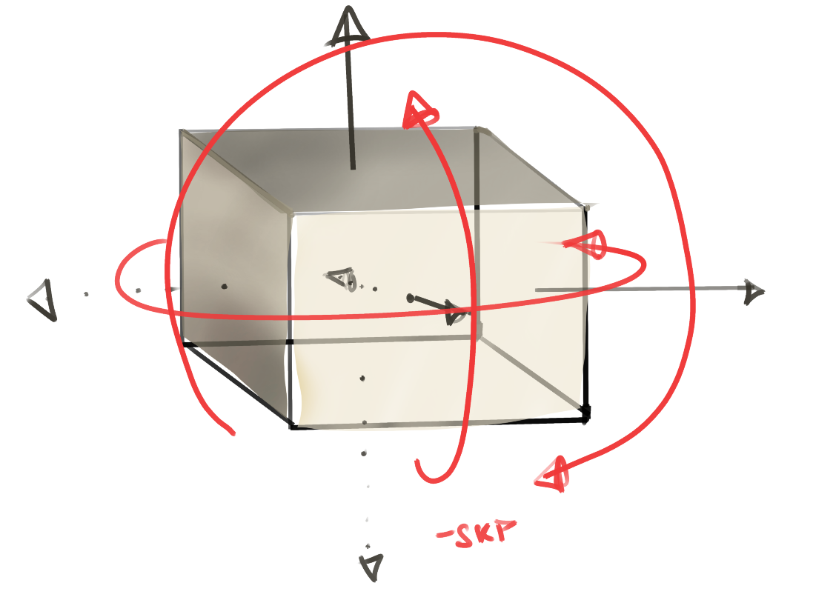
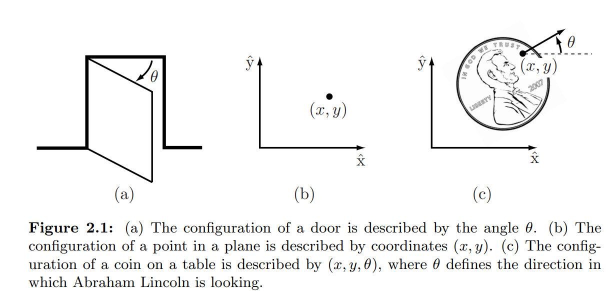
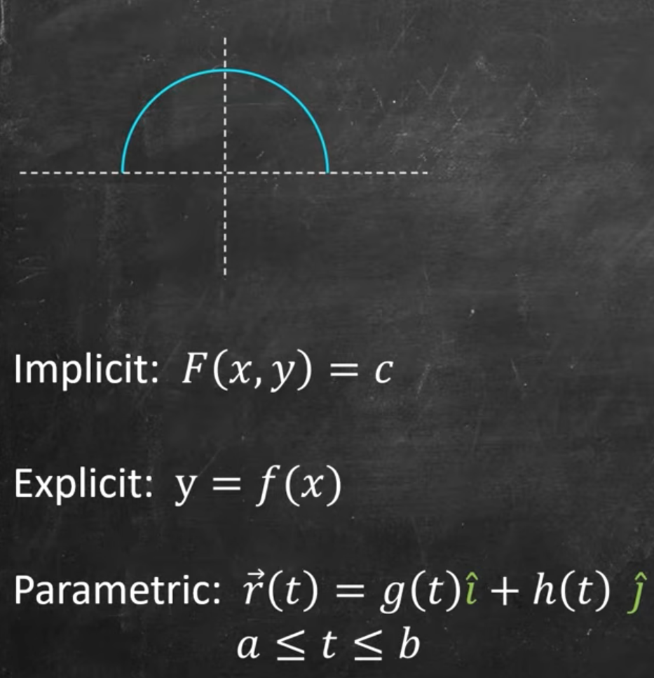
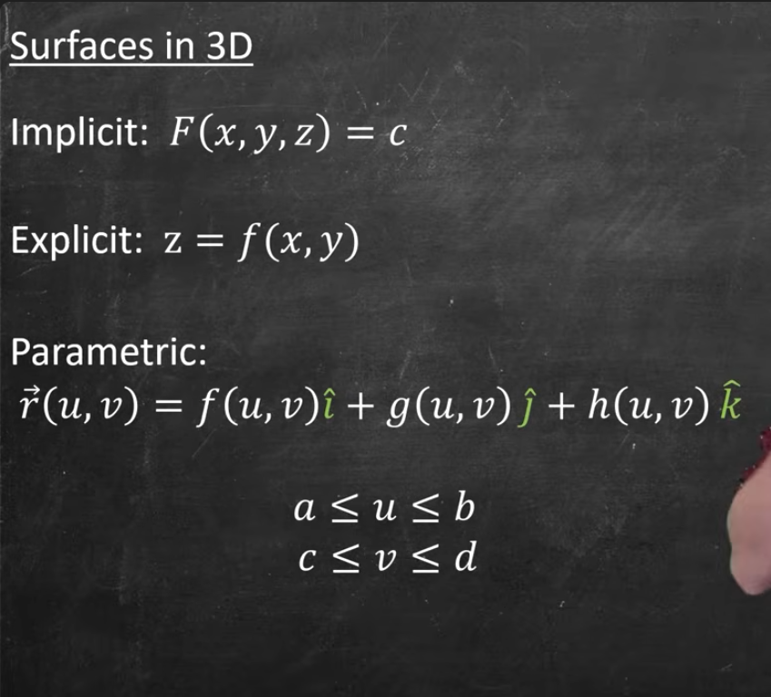

>Chapter 2 page:29 focuses on representing the configuration
of a robot system, which is a specification of the position of every point of the
robot. 

## Concept Degrees of freedom and Configuration Space
We see that the configuration of a rigid body in a fixed `plane` can be described
using three variables (two for the position and one for the orientation)
 [Sundeep: Interpretation by me]

 and the
configuration of a rigid body in `space` can be described using six variables (three
for the position and three for the orientation). The number of variables is the
number of degrees of freedom (dof) of the rigid body.
 It is also the dimension
of the `configuration space, The n-dimensional space containing all possible
configurations of the robot is called the configuration space (C-space).`
 [Sundeep: Interpretation by me]

[Sundeep:]a point on a straight line let's say y =x has 1 degree of degree. A point of a flat floor has dof =2 ; configuration is a function of 2 variables i.e f(x,y). 

similary body on a flat floor has 3 and body in space has 6 as shown in the figure drawn by me

### configuration space for point in a line-- 

A point can be at any position x on the line `q = x`

Therefore

$$
C = \{x \mid x \in \mathbb{R}\} = \mathbb{R}
$$

The configuration space is a 1-dimensional line.


### configuration space for point in a plane -- 
point can be on q = (x,y)
$$
C = \{(x,y) \mid x,y \in \mathbb{R}\} = \mathbb{R}^2
$$


For a rigid body, we need to specify both its position and orientation.

### configuration space for Rigid body in a plane--

Configuration:

q=(x,y,θ)

$$
C = \{(x,y,\theta)\mid x,y\in\mathbb{R},\ \theta\in S^1\}
= \mathbb{R}^2\times S^1
$$

> what's $S^1$?

$\theta \in 360 \degree$

```
      90°
       |
180° --+-- 0° (=360°)
       |
      270°
```

This circle is called: $S^1$


Anyway the conclusion is similar to how the range of real numbers is called $\mathbb{R}$ , the range of angles is called $S^1$



 


## dof of a robot

> "The dof of a robot, and hence the dimension of its configuration space, is
> the sum of the dof of its rigid bodies minus the number of constraints on the
> motion of those rigid bodies provided by the joints"

**what do we mean by constraints?**

For example, the two most
popular joints, revolute (rotational) and prismatic (translational) joints, allow
only one motion freedom between the two bodies they connect. Therefore a
revolute or prismatic joint can be thought of as providing five constraints on
the motion of `one spatial rigid body` *relative* to `another spatial rigid body` ([sundeep:] I guess the two links i.e rigid bodies connected with the joint).


## Topology i.e shape of configuration space
[sundeep:]
shape of configuration space let's the surface of a sphere or a flat plane, can be described either explicitly of implicitly, or even parametrically

Here's a great video explaining them -- 

https://www.youtube.com/watch?v=jZRqCfi5_Uo ~Dr. Trefor Bazett -- credits and permission-- 





**what that means in practice?**

The surface of a unit sphere, for example,

could be represented by three numbers (x, y, z) subject to
the constraint 
$$
x^2 + y^2 + z^2 = 1. 
$$ 
(implicit)

or
could be represented using a minimal number of coordinates, such as latitude
and longitude i.e $p=f(La,Lo)$ which is similar to $z = 1-( x^2 + y^2)  $ 

(explicit)

## Other common terms

`End effector`: A robot arm is typically equipped with a hand or gripper, more generally
called an end-effector, which interacts with objects in the surrounding world.

> >To accomplish a task such as picking up an object, we are concerned with the
> configuration of a reference frame rigidly attached to the end-effector, and not
> necessarily the configuration of the entire arm. We call the space of positions
> and orientations of the end-effector frame the `task space`.

there is `not a one-to-one mapping` between the robot’s configuration space and the
task space. [sundeep:] **what does that mean ARGHHH** --

e.g

| arm            | gripper       |robot's Overall Configuration space
| --------------------- | ------------- |---------- |
| Configuration A       | config alpha          | 1.        |
| Configuration B       | config. alpha         | 2.        |

one-to-one would have meant that for every unique overall config. , there exist a unique config of the end effector , which may not be true like the example above 

the orientations of the end-effector i.e  the space in which the robot's task is expressed is called `Task space`. It mainly focuses on the task. For e.g when controlling a 3d cube using a gripper, our focus i.e task space is the 6 dimensional configurations of the cube.(we ignore the robot)

while the `workspace` (a subset of task space) -- basically out of the positions and orientations of the task object, how much of it can the end effector (let's say gripper) reach. 

~ Kevin Lynch-- co author of the book on Northwestern Robotics - - https://www.youtube.com/watch?v=hTuW51CpUg4&list=PLggLP4f-rq02vX0OQQ5vrCxbJrzamYDfx&index=9


