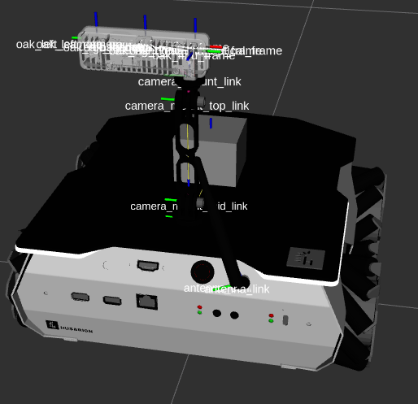
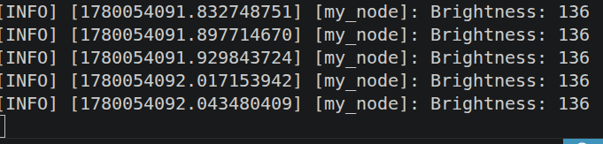

**We will use our camera to calculate the average brightness of the received image through a subscriber node**

>In this part I have got REALLY deep into some fundamentals and it took me around  2 full days and I would recommend not going in too deep into as a begineer. 

>Only read the entire thing if you wanna understand exactly why we are using these weird functions and techniques instead of writing simple code  ,and also yeah if you hate yourself like me :D

Follow this file for the following walkthrough
[2.avg_brightness](../workspaces/ros2_ws/src/tutorial_pkg/src/2.avg_brightness.cpp)

*A subscriber is something that receives messages from a topic (in this case the /image node)*

Let's say if :-
```
[publisher node]--message-->(topic)
```
then we can receive the message in another node like--
```
(topic)-->[subscriber node] 
```

After shitting my panting looking at the code for the first time, I decided to learn the c++ fundamentals that make up this piece of code --(using gpt)

>*contributors please don't change this typo this shits too funny to be changed*

We'll go in this order:

What is :: and namespaces → understand std::
What is std
What are functions and function names
What does & mean here
What is this
What is bind()
What are placeholders and _1
Finally rebuild the ROS line completely.


1. Namespace = just grouping names

A namespace only organizes code and avoids name collisions.

```

namespace math
{
    int add(int a, int b)
    {
        return a + b;
    }
}

```

this can be called like math::add(2,3)


*difference between namespace and class*

```

class Dog
{
public:
    void bark()
    {
        std::cout << "Woof";
    }
};

```

This is not merely organization.

It defines:

behavior
data
objects

now

```

Dog d1;
Dog d2;

```

are two separate objects each with their own memory allocations done independlty

so practically namespace is kinda equivalent to using only one single class object (kinda, for most
 practical uses as far as i understand)


**using namespace std;**
This means:

"I want to use everything inside std without writing std::"

instead of:

std::cout

you write:

cout

Instead of:

std::string

you write:

string


--------

&function means address of function (we can use it to pass functions as arguments in other functions ) e.g &MyNode::image_callback {do not use function() , only function bcz adding () will immediately run the function}

--------

**What is this?** yeah :D 
this means:

"the current object"

The object whose function is running.


----

In C++, **std::make_shared()** is a function that returns a shared pointer to the object of specific type after dynamically creating it. It offers a safer and more efficient way to create shared pointers, reducing the chances of errors and improving performance.~gfg
 
(its like malloc in c  new function in c++ orbut it automatically handles memory cleanup and shit)


*keep in mind we aren't creating static objects like Dog d1, we are creating dynamic objects*

"Static objects" — i.e stack-allocated objects (e.g. MyNode node;). They're just allocated/deallocated automatically as the stack frame is entered/exited. Fast, but their lifetime is tied to their scope (scope as in the function they were defined inside of , when the function stops the object is automatically deleted).


"Dynamic objects" — heap-allocated (e.g. new MyNode() or make_shared<MyNode>()). Lifetime is manually controlled, which is exactly what ROS2 needs.

so instead of doing MyNode* ptr = new MyNode(); (replace new for malloc in c)

and later delete ptr;

you can do 

```

auto p1 = std::make_shared<MyNode>();

```

another big advantage is that now that I have a ptr to the object, I can access the object from anywhere like inside a function.

we use "**auto**" to let the compiler figure stuff out like in python. instead of int a = 5 just write auto a =5 . 

here for the type std::shared_ptr<MyNode> , we simply write auto to let the compiler figure that out.

------

What is -> ?

means:

"go through pointer and access member"
e.g
this->age

Equivalent to:

(*this).age

---------

A callback is simply:

a function that you give to someone else(a function) so they can call it later.
e.g usecase --Which function should be called later when the event happens?

You answer by giving:

image_callback

through:

std::bind(&MyNode::image_callback, this, _1)

------

**What is bind()?**

bind() means:

prepare a function call for later

Example:

Function:

void greet(std::string name)
{
    std::cout << name;
}

Now:

auto f = std::bind(greet, "Sundeep");

This does NOT print anything.

Why?

Because bind() does not run.

It prepares.

Later:

f();

NOW it runs.
Output:

Sundeep

*we can use bind for any event based requirements like gui buttons*

Syntax:
td::bind(function-to-call, object/value whose function to be called, arguments...); ~[gfg](https://www.geeksforgeeks.org/cpp/working-and-examples-of-bind-in-cpp-stl/)

**Summary of why we are doing all this bind and &function bullshit**


Let's take a small e.g, let's detect a button press (assuming there's a button_node that publishes the state of the button on /button topic  )

possible ways to approach this --

**A. polling** we can constantly poll the /button topic using a while true infinite loop and use a if condition to check if the button is pressed. problem : A robot might have 20+ nodes running simultaneously — LIDAR, camera, IMU, GPS, motor controllers, planners. If every single one is spinning in a tight while loop checking "did my data arrive yet?", you're wasting enormous CPU just on waiting.

**B. callbacks/interrupts** A camera might publish at 30Hz, 60Hz, or burst randomly. With polling you have to pick a loop rate — too slow and you miss frames, too fast and you waste CPU. With callbacks, you respond exactly when data arrives, no more, no less. We register a function with create_subscription() and let rclcpp::spin() watch all topics at the OS level — firing our callback the moment data arrives, and leaving the CPU free otherwise. Same idea as attachInterrupt() on an ESP32 instead of polling a GPIO pin in a loop.    

rclcpp::spin() is essentially the interrupt controller — it watches all registered topics at the OS/middleware level (using things like epoll under the hood, same mechanism as async I/O in Linux) and dispatches your callback the moment data is ready. The CPU is genuinely idle between messages.


POLLING MULTIPLE TOPICS-- 

// Polling 3 topics — already ugly
while (rclcpp::ok()) {
    if (new_image())     process_image();
    if (new_lidar())     process_lidar();
    if (new_imu())       process_imu();
    if (new_gps())       process_gps();
    // ... 20 more sensors
}

here using callbacks (analogous to interrupts) becomes even more useful


-------

**Executors** 

Execution management in ROS 2 is handled by Executors. An Executor uses one or more threads of the underlying operating system to invoke the callbacks of subscriptions, timers, service servers, action servers, etc. on incoming messages and events. ~ https://docs.ros.org/en/rolling/Concepts/Intermediate/About-Executors.html

Breakdown (by llm claude)--

Threads-- A thread is just the CPU working through instructions one by one. Your program by default has one.. Your OS can run multiple things "at once". Each independent stream of execution is a thread.

Your program starts → 1 thread (main thread)

main thread:
─────────────────────────────────────────────→ time
init → create node → spin → [waiting...]


relating back to the polling vs callbacks concept --

**Polling**

```
thread: ──[check]──[check]──[check]──[check]──[check]──→ time
```

The thread is actively burning CPU the entire time just checking. It never sleeps, never frees the CPU for other work. It's not "stopping everything" — it's doing useless work continuously.

**Callbacks (with epoll/spin)**

```
thread: ──[sleeping]──────────────────[wake]──[callback]──[sleep]──→ time
                  ↑                       ↑
            epoll_wait()            kernel: "data arrived"
            hands CPU to OS         OS schedules your thread back
```

The thread is genuinely asleep between events. The OS gives that CPU time to other processes. When data arrives, kernel wakes your thread up and the executor calls your callback.


**Basic use of Executors (rclcpp::spin)**

>[What the spin command does in simple terms](https://answers.ros.org/question/388589/) 

In the simplest case, the main thread is used for processing the incoming messages and events of a Node by calling rclcpp::spin(..) as follows:

```
int main(int argc, char* argv[])
{
   // Some initialization.
   rclcpp::init(argc, argv);
   ...

   // Instantiate a node.
   rclcpp::Node::SharedPtr node = ...

   // Run the executor.
   rclcpp::spin(node);

   // Shutdown and exit.
   ...
   return 0;
}
```

The call to spin(node) basically expands to an instantiation and invocation of the Single-Threaded Executor, which is the simplest Executor:

```
rclcpp::executors::SingleThreadedExecutor executor;
executor.add_node(node);
executor.spin();
```

By invoking spin() of the Executor instance, the current thread starts querying the rcl and middleware layers for incoming messages and other events and calls the corresponding callback functions until the node shuts down.

> in summary, spin() does
```
    wait
    wait
    message?
    run callback
    repeat
```

Lastly --
## What is _1?
means:

"Put the first future input/argument here."

it's just a placeholder

For 2 inputs, you would do 
```
std::bind(function-to-callback, object-that-the-function-belongs-to, _1,_2)
```

and so on for any number of inputs


The rest of the code should be easy to understand now with simple comments in the code here - [avg_brightness.cpp](/ros2-roadmap-ultralab/workspaces/ros2_ws/src/tutorial_pkg/src/avg_brightness.cpp)

[sensor_msgs/msg/image.hpp](https://docs.ros.org/en/noetic/api/sensor_msgs/html/msg/Image.html) provides the blueprint of a message type:

sensor_msgs::msg::Image

similar to a class.(though not exactly-- I haven't tried undertanding quite how yet)

therefore sensor_msgs::msg::Image::SharedPtr image 

>incase you're wondering like me wtf is a SharedPtr, gpt told me its a type of smart pointer(same as normal pointer except its more safe and reliable and it can do cleanup and memory shit automatically) where multiple owners can safely share same object
. Don't need to know too much rn , just that its safer than using normal pointers.

in normal c++ , we do 
```
std::shared_ptr<sensor_msgs::msg::Image>
```
in ros we do 
```
sensor_msgs::msg::Image::SharedPtr
```

its an alias (nickname)


-----

>more informative stuff : https://docs.ros2.org/foxy/api/rclcpp/classrclcpp_1_1Node.html (more about rclcpp::Node class , especially the Node function). 

> ### templates in c++ -- 
C++ Templates
Templates let you write a function or class that works with different data types.

They help avoid repeating code and make programs more flexible.
```
template <typename T>
return_type function_name(T parameter) {
  // code
} 
```
T is a placeholder for a data type (like int, float, etc.).
You can use any name instead of T, but T is common.
~[w3schools](https://www.w3schools.com/cpp/cpp_templates.asp)

e.g 

  subscriber_ = create_subscription **<sensor_msgs::msg::Image>**(
         "/image", rclcpp::SensorDataQoS(), std::bind(&MyNode::image_callback, this, _1));

Here were are using image data type

> ### more on create_subscription() 
```
create_subscription(
    node,
    topic_name,
    qos,
    callback
)
```
>## QoS(Quality of Service) 
controls:
HOW messages should be delivered.

```
The base QoS profile currently includes settings for the following policies:

History

Keep last: only store up to N samples, configurable via the queue depth option.

Keep all: store all samples, subject to the configured resource limits of the underlying middleware.

Depth

Queue size: only honored if the “history” policy was set to “keep last”.

Reliability

Best effort: attempt to deliver samples, but may lose them if the network is not robust.

Reliable: guarantee that samples are delivered, may retry multiple times.

Durability

Transient local: the publisher becomes responsible for persisting samples for “late-joining” subscriptions.

Volatile: no attempt is made to persist samples.

Deadline

Duration: the expected maximum amount of time between subsequent messages being published to a topic

Lifespan

Duration: the maximum amount of time between the publishing and the reception of a message without the message being considered stale or expired (expired messages are silently dropped and are effectively never received).

Liveliness

Automatic: the system will consider all of the node’s publishers to be alive for another “lease duration” when any one of its publishers has published a message.

Manual by topic: the system will consider the publisher to be alive for another “lease duration” if it manually asserts that it is still alive (via a call to the publisher API).

Lease Duration

Duration: the maximum period of time a publisher has to indicate that it is alive before the system considers it to have lost liveliness (losing liveliness could be an indication of a failure).
```

Standard QoS presets:
*BestAvailableQoS, ClockQoS, ParameterEventsQoS,ParametersQoS,RosoutQoS, [SensorDataQoS](https://docs.ros.org/en/jazzy/p/rclcpp/generated/classrclcpp_1_1SensorDataQoS.html#exhale-class-classrclcpp-1-1sensordataqos), ServicesQoS, SystemDefaultsQoS* , [more info on them](https://docs.ros.org/en/jazzy/p/rclcpp/generated/classrclcpp_1_1QoS.html?)
## More doubts that i had 

1. *I have a doubt about rclcpp::Node::node() function. I heard that it initialises the node . but what does that even mean.*

Also why are there so many functions like node() , 

```cpp
  rclcpp::init(argc,argv); //start the underlying ros communication layer

    auto node = std::make_shared<MyNode>(); //make object called node using MyNode class
    rclcpp::spin(node); // put the node of the main thread

    rclcpp::shutdown(); // stop ros communication layer

```

why isn't there a smarter way to do this, why so much manual work, when i probably need to do that in every single node i make.

claude answers(summarised) -- 

what the Node() function does --
```
Node("my_node")
    ├── registers the name "my_node" with the ROS2 graph
    ├── creates a logger (so RCLCPP_INFO knows who's printing)
    ├── creates a clock
    ├── sets up internal communication handles (DDS participant)
    └── allocates all internal bookkeeping structures
```

what the other functions do --
```
rclcpp::init()      → boots the middleware (happens once per process)
make_shared<Node>() → creates YOUR node (can make many nodes per process)
spin()              → runs the event loop (you choose when and how)
shutdown()          → cleanup
```
>You might have multiple nodes in one process, or swap spin() for *MultiThreadedExecutor*, or spin manually. Keeping them separate gives you that control.

these lines:
 ```
int main(int argc, char **argv) {
    rclcpp::init(argc, argv);
    rclcpp::spin(std::make_shared<MyNode>());
    rclcpp::shutdown();
}
```
are so standard that most ROS2 devs just copy-paste them for every node and only ever change MyNode

>claude also mentioned something about rclcpp_components and the component lifecycle but it said that I am too dumb to understand it rn so yeah ok

2. https://docs.ros.org/en/jazzy/p/rclcpp/generated/classrclcpp_1_1QoS.html?https://docs.ros.org/en/jazzy/p/rclcpp/generated/classrclcpp_1_1SensorDataQoS.html#exhale-class-classrclcpp-1-1sensordataqos
### These pages show the QoS presets like classes  but i used them as functions?

(claude:) In C++, ClassName() = creating an object (by calling the constructor)
This is constructing a temporary object of type SensorDataQoS, right there inline. It's equivalent to:
```
cpprclcpp::SensorDataQoS my_qos;          // named object
create_subscription<...>("/image", my_qos, ...);

// vs inline (what the tutorial does):
create_subscription<...>("/image", rclcpp::SensorDataQoS(), ...);
```
Both do the same thing. The inline version just skips giving it a name 


finally,

# explaination of private chunk

Great, let me build this up from the ground.

---

## What is an Image, fundamentally?

A digital image is just a **grid of pixels**. Each pixel has color values. For a typical **RGB image**:

```
Pixel = [R, G, B]  →  3 numbers
Each number = 0 to 255
```

0–255 fits exactly in **1 byte = `uint8_t`** (unsigned 8-bit integer).

So a 640×480 image is just:
```
640 × 480 × 3 = 921,600 bytes
```
stored flat in a 1D array, one after another in memory.

---

## `image->data` — what is it?

In ROS 2, `sensor_msgs::msg::Image` has a field:
```cpp
std::vector<uint8_t> data;
```
It's literally that flat array of raw bytes — every pixel's R, G, B value, one byte each, packed sequentially.

```
[R, G, B, R, G, B, R, G, B, ...]
  pixel1    pixel2    pixel3
```

---

## The callback, line by line

```cpp
void image_callback(const sensor_msgs::msg::Image::SharedPtr image)
```
- Called every time a new image arrives on the topic
- `SharedPtr` = a smart pointer — you're not copying the whole image, just holding a reference to it. Think of it as a handle.

---

```cpp
long long sum = 0;
```
- `long long` = 64-bit integer, holds very large numbers
- Why not `uint8_t` for sum? Because 921,600 bytes × max value 255 = **~235 million** — way too big for a `uint8_t` (max 255) or even a regular `int`

---

```cpp
for (uint8_t value : image->data)
{
    sum += value;
}
```
- Range-based for loop — walks through every byte in that flat array
- Each `value` is one byte (0–255), one channel of one pixel
- Adds them all into `sum`

---

```cpp
int avg = sum / image->data.size();
```
- `image->data.size()` = total number of bytes (e.g. 921,600)
- Divides total sum by count → **average byte value across all channels**
- Result is 0–255, fits in `int`

---

```cpp
RCLCPP_INFO(get_logger(), "Brightness: %d", avg);
```
- Prints the average to the ROS log
- Higher average → brighter image overall

---

## The bottom line visually

```
image->data = [255, 255, 255,  0, 0, 0,  128, 128, 128, ...]
               ^^^white pixel   ^^^black   ^^^grey

sum all bytes → divide by count → single "brightness" number
```

It's a very naive brightness estimate — it doesn't distinguish R/G/B, just averages all bytes. But it demonstrates how raw image data works.

---

## The subscriber line

```cpp
rclcpp::Subscription<sensor_msgs::msg::Image>::SharedPtr subscriber_;
```

- `Subscription<sensor_msgs::msg::Image>` — a subscription that expects Image messages specifically
- `::SharedPtr` — again, a smart pointer (the subscription object is heap-allocated and reference counted)
- `subscriber_` — just the member variable that keeps the subscription alive; if this gets destroyed, your node stops receiving images


------

## registering Dependency

Finally , I added the dependency (sensor_msgs) to CMakeLists.txt


>Debugging, the ROSBOT_SIM launch command fails for some reason . Solved after installing ros2 control pkg and ros-humble-imu-sensor-broadcaster based on the logs

> Another issue, gazebo seems to be running on my iGPU rather than my dedicated gpu.  
gpt sol.:- (*I am still not satisfied with this solution and want contributors to find better solutions*)

chatgpt --- 
# Gazebo + NVIDIA GPU Rendering Notes (ROS2 Humble + Ignition/GZ)

## Problem

Gazebo launched correctly but showed inconsistent behavior when forcing NVIDIA GPU rendering:

* Gazebo window opened
* RViz opened
* Robot sometimes failed to spawn
* `controller_manager` became unavailable
* `gz_ros2_control` failed to initialize
* Launch shut down after controller timeout

Typical symptoms:

```bash
waiting for service /controller_manager/list_controllers
Could not contact service /controller_manager/list_controllers
```

and/or:

```bash
libEGL warning: egl: failed to create dri2 screen
```

---

## Cause

System uses hybrid graphics (iGPU + NVIDIA dGPU with PRIME offloading).

Default NVIDIA offload caused Gazebo to use a rendering path that interfered with `gz_ros2_control` and plugin initialization.

The issue was **not**:

* ROS2
* mecanum controller
* kernel version
* robot model

The problem was specifically:

```text
NVIDIA PRIME + Gazebo direct/EGL rendering path
```

which prevented `controller_manager` from appearing.

---

## Working Launch Command

Use:

```bash
__NV_PRIME_RENDER_OFFLOAD=1 \
__GLX_VENDOR_LIBRARY_NAME=nvidia \
LIBGL_ALWAYS_INDIRECT=1 \
ros2 launch <launch_file>
```

Example:

```bash
__NV_PRIME_RENDER_OFFLOAD=1 \
__GLX_VENDOR_LIBRARY_NAME=nvidia \
LIBGL_ALWAYS_INDIRECT=1 \
ros2 launch rosbot_gazebo simulation.launch.py robot_model:=rosbot_xl
```

---

## Variable Meanings

### 1. `__NV_PRIME_RENDER_OFFLOAD=1`

Enables NVIDIA PRIME render offloading.

Meaning:

```text
Render this application using the NVIDIA GPU
instead of the integrated GPU.
```

The desktop may still run on the iGPU while Gazebo renders on the dGPU.

---

### 2. `__GLX_VENDOR_LIBRARY_NAME=nvidia`

Forces OpenGL/GLX to use NVIDIA libraries instead of Mesa/iGPU libraries.

Prevents mismatches such as:

```text
NVIDIA render request
+
Mesa OpenGL stack
=
broken rendering/plugin behavior
```

Meaning:

```text
Use NVIDIA OpenGL implementation.
```

---

### 3. `LIBGL_ALWAYS_INDIRECT=1`

Forces indirect OpenGL rendering through GLX/X11 instead of direct rendering.

This was the critical fix.

Meaning:

```text
Use a safer compatibility rendering path
instead of direct EGL rendering.
```

This avoided the PRIME/EGL issue that prevented:

* `gz_ros2_control`
* `controller_manager`
* robot spawning

from initializing correctly.

---

## Important Note

Do NOT globally export these variables in `.bashrc`.

Global exports changed behavior unpredictably and caused plugin initialization failures.

Prefer:

* per-launch command
* alias
* wrapper script

instead.

---

## Cleanup When Gazebo Misbehaves

Sometimes Gazebo server does not terminate cleanly.

Check:

```bash
ps aux | grep -E "ign|gz|controller|ruby"
```

If stale processes remain:

```bash
pkill -f ign
pkill -f gz
pkill -f controller_manager
pkill -f ruby
```

Reset ROS daemon:

```bash
ros2 daemon stop
ros2 daemon start
```

Then relaunch.

Symptoms of stale Gazebo server:

```text
controller_manager missing
spawner timeout
non-deterministic launches
works one run, fails next run
```

---

## Final Diagnosis

Working configuration:

```text
NVIDIA dGPU
+
PRIME render offload
+
NVIDIA GLX
+
Indirect OpenGL rendering
=
Stable Gazebo + ROS2 control + robot spawning
```


Next before building the package, I need to CMakeLists.txt to add the executable avg_brigtness and dependencies--

```
...
add_executable(my_first_node src/1.my_first_node.cpp)
add_executable(avg_brightness src/2.avg_brightness.cpp)
ament_target_dependencies(my_first_node rclcpp sensor_msgs)
ament_target_dependencies(avg_brightness rclcpp sensor_msgs)

install(TARGETS
  my_first_node
  avg_brightness
  DESTINATION lib/${PROJECT_NAME}
)
...

```

now source install/setup.bash in rosbot_ws and run the launch file there (make sure sure that in the alias for ROSBOT_SIM in bashrc has *configuration:=autonomy* at the end). Rviz should look like this--


With the camera attached (bcz of configuration:=autonomy, it doesn't do that by default as told by husarion team) 

now we source install/setup.bash in ros2_ws .

the topic adverstising the camera image is /oak/rgb/color
therefore we run :

```
ros2 run tutorial_pkg avg_brightness --ros-args -r /image:=/oak/rgb/color
```



