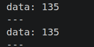

> we are creating a publisher node that can publish the average brightness result into a new topic

Follow this file for the following walkthrough
[3.publisher](../workspaces/ros2_ws/src/tutorial_pkg/src/3.publisher.cpp)

[the code in the docs didn't mention](https://husarion.com/tutorials/ros2-tutorials/2-creating-nodes-messages/#creating-a-publisher) 
```
using namespace std::placeholders;
```
for some reason

anyways, with this changes, again add shit to CMakeLists.txt
```
cmake_minimum_required(VERSION 3.8)
project(tutorial_pkg)

# Set C++ standard to C++14
if(NOT CMAKE_CXX_STANDARD)
  set(CMAKE_CXX_STANDARD 14)
endif()

if(CMAKE_COMPILER_IS_GNUCXX OR CMAKE_CXX_COMPILER_ID MATCHES "Clang")
  add_compile_options(-Wall -Wextra -Wpedantic)
endif()

# find dependencies
find_package(ament_cmake REQUIRED)
find_package(rclcpp REQUIRED)
find_package(sensor_msgs REQUIRED)
find_package(std_msgs REQUIRED)

if(BUILD_TESTING)
  find_package(ament_lint_auto REQUIRED)
  # the following line skips the linter which checks for copyrights
  # comment the line when a copyright and license is added to all source files
  set(ament_cmake_copyright_FOUND TRUE)
  # the following line skips cpplint (only works in a git repo)
  # comment the line when this package is in a git repo and when
  # a copyright and license is added to all source files
  set(ament_cmake_cpplint_FOUND TRUE)
  ament_lint_auto_find_test_dependencies()
endif()

add_executable(my_first_node src/my_first_node.cpp)
add_executable(avg_brightness src/avg_brightness.cpp)
add_executable(publisher src/publisher.cpp)
ament_target_dependencies(my_first_node rclcpp sensor_msgs)
ament_target_dependencies(avg_brightness rclcpp sensor_msgs)
ament_target_dependencies(publisher rclcpp sensor_msgs std_msgs)

install(TARGETS
  my_first_node
  avg_brightness
  publisher

  DESTINATION lib/${PROJECT_NAME}
)

ament_package()
```

run using
```
ros2 run tutorial_pkg publisher --ros-args -r /image:=/oak/rgb/color
```

we should now be publishing to /brightness topic.

to confirm --

```
ros2 topic echo /brightness
```

> now i wasn't seeing any output in the topic so i added this debug --  RCLCPP_INFO(get_logger(),"debug: image received "); inside of the definition of image_callback. later found that i just f-ed up with the argument in the run command




Finally the docs talk about [common msg types](https://husarion.com/tutorials/ros2-tutorials/2-creating-nodes-messages/#message-types)


btw props to Rafał Górecki from the Husarion team for this crazy document. I have literally cried at trying to learn from the official ros docs using turtlesim. 