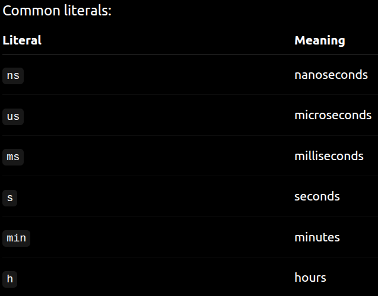
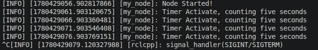

[timer.cpp](/ros2-roadmap-ultralab/workspaces/ros2_ws/src/tutorial_pkg/src/timer.cpp)

> "< chrono >" is a C++ header that provides a collection of types and functions to work with time. ~[geeksforgeeks](https://www.geeksforgeeks.org/cpp/chrono-in-c/)

Timers are different from sleep/ delay , bcz 

A delay answers: Stop execution for some time.

A timer schedules actions, It doesn't block the thread, so other operations still continue. 

ROS wall timers use a steady timing source internally to avoid weird jumps.(steady_clock -- will be covered later). It never goes backward, only forward(0,1,2,3,..)

### imp terms 
--- 
~gpt 

>Resolution: Smallest measurable step.(e.g 1 ms)

>Accuracy: How close to truth. 

(e.g Requested: 100ms

Actual: 120ms

Accurate? No.)

>Precision: consistency

(
tick-length: 10ms, 10ms, 10ms, 10ms... --precise

tick-lenth: 8ms, 12ms, 10ms, 9ms.. --not precise

)

>time_point : the current time moment i.e this instant

>Epoch — Where Time Starts. Time point is measured relative to an origin.

---
### chrono library

- It has *namespace std::chrono_literals;* which is actually a user-defined literal that let's us write things like: 500ms . the "ms for millisecond or s for second" doesn't exist by default.

    In the background its doing 
    ```
    std::chrono::milliseconds(500)
    ```
    
    

> Further extra concepts -- you should probably skip directly to [create_wall_timer()](#function-rclcppcreate_wall_timer) 

What is a Clock?: 

A clock answers: What time is it right now?

C++ gives 3 major clocks. --

### system_clock : current time

e.g 
```
auto now =
    std::chrono::system_clock::now();
```

Use it for:

✅ timestamps

❌ measuring elapsed time (not ideal, e.g if timezone changes or internet sync issue)

### steady_clock : monotinic time
never goes backward,
steadily increases

Used for:

timers

benchmarking

robotics

elapsed time

### high_resolution_clock

highest resolution available

But internally it may be:

steady_clock

system_clock

Use when:

>you specifically want max resolution and you know platform behavior
---
### Measuring Elapsed Time

```
using namespace std::chrono;

auto start =
    steady_clock::now();

do_work() //or whatever your function being used is e.g move()

auto end =
    steady_clock::now();

auto elapsed =
    end - start;
```

>notice how when we call **steady_clock::now()** , we didn't need to stop any ongoing process. Its bcz **we aren't actually starting some new clock** . We are reading from the OS monotonic counter (TSC/HPET etc.), which is already running continuously — managed entirely by the OS/hardware.The clock has been ticking since system boot. now() simply reads the current value of that counter.

quick summary ~gpt 

| Clock | Quick Description | Source | Monotonic? | Typical Resolution* | Pros | Cons | ROS2 / Robotics Use | Common Functions | Notes |
|---|---|---|---|---|---|---|---|---|---|
| `system_clock` | Real-world / calendar time | OS system time (RTC + OS timekeeping, NTP, user settings) | ❌ No | ms–µs (platform dependent) | Human-readable, timestampable, convertible to date/time | Can jump forward/backward | Logging, timestamps, file times, event records | `system_clock::now()` | Represents "wall time" |
| `steady_clock` | Always-forward elapsed-time clock | Monotonic OS/hardware timer (TSC/HPET etc.) | ✅ Yes | µs–ns (platform dependent) | Stable, no backward jumps, ideal for timing | Not human-readable, arbitrary epoch | Timers, control loops, benchmarking, ROS timer internals | `steady_clock::now()` | Usually preferred for robotics timing |
| `high_resolution_clock` | Highest available resolution clock | Alias to best platform clock | Depends | Often ns | Potentially highest precision | Behavior varies by platform; may be `system_clock` or `steady_clock` | Specialized profiling, performance measurement | `high_resolution_clock::now()` | Not guaranteed monotonic |


---


What is a Clock?: 

A clock answers: What time is it right now?

C++ gives 3 major clocks. --

### system_clock : current time

e.g 
```
auto now =
    std::chrono::system_clock::now();
```

Use it for:

✅ timestamps

❌ measuring elapsed time (not ideal, e.g if timezone changes or internet sync issue)

### steady_clock : monotinic time
never goes backward,
steadily increases

Used for:

timers

benchmarking

robotics

elapsed time

### high_resolution_clock

highest resolution available

But internally it may be:

steady_clock

system_clock

Use when:

>you specifically want max resolution and you know platform behavior
---
### Measuring Elapsed Time

```
using namespace std::chrono;

auto start =
    steady_clock::now();

do_work() //or whatever your function being used is e.g move()

auto end =
    steady_clock::now();

auto elapsed =
    end - start;
```

>notice how when we call **steady_clock::now()** , we didn't need to stop any ongoing process. Its bcz **we aren't actually starting some new clock** . We are reading from the OS monotonic counter (TSC/HPET etc.), which is already running continuously — managed entirely by the OS/hardware.The clock has been ticking since system boot. now() simply reads the current value of that counter.

quick summary ~gpt 

| Clock | Quick Description | Source | Monotonic? | Typical Resolution* | Pros | Cons | ROS2 / Robotics Use | Common Functions | Notes |
|---|---|---|---|---|---|---|---|---|---|
| `system_clock` | Real-world / calendar time | OS system time (RTC + OS timekeeping, NTP, user settings) | ❌ No | ms–µs (platform dependent) | Human-readable, timestampable, convertible to date/time | Can jump forward/backward | Logging, timestamps, file times, event records | `system_clock::now()` | Represents "wall time" |
| `steady_clock` | Always-forward elapsed-time clock | Monotonic OS/hardware timer (TSC/HPET etc.) | ✅ Yes | µs–ns (platform dependent) | Stable, no backward jumps, ideal for timing | Not human-readable, arbitrary epoch | Timers, control loops, benchmarking, ROS timer internals | `steady_clock::now()` | Usually preferred for robotics timing |
| `high_resolution_clock` | Highest available resolution clock | Alias to best platform clock | Depends | Often ns | Potentially highest precision | Behavior varies by platform; may be `system_clock` or `steady_clock` | Specialized profiling, performance measurement | `high_resolution_clock::now()` | Not guaranteed monotonic |


---

Back on to the code ---

### [Function rclcpp::create_wall_timer](https://docs.ros.org/en/kilted/p/rclcpp/generated/function_namespacerclcpp_1aa3ce62ebcda2516e5017b0eab01b4169.html)

~ros2docs

Returns
:
shared pointer to a wall timer  

all possible parameters:

```
rclcpp::create_wall_timer(
    period,
    callback,
    group,
    node_base,
    node_timers,
    autostart
)
```

| Parameter     | Meaning             | Usually            |
| ------------- | ------------------- | ------------------ |
| `period`      | timer interval      | `5s`               |
| `callback`    | function to run     | `std::bind(...)`   |
| `group`       | callback group      | default if omitted |
| `node_base`   | node core interface | auto-filled        |
| `node_timers` | node timer manager  | auto-filled        |
| `autostart`   | start immediately?  | `true`             |

do make sure that 0 <= period < nanoseconds::max()

bcz negative periods throw errors

> btw the parameter autostart If false then: create paused timer and later: timer_->reset(); starts it.

I had a doubt -- I thought we are just reading the clock from the hardware timer then why the need for "starting the timer"--

The reason is --
create_wall_timer() is NOT a clock.

It is a scheduler built on top of clocks.

 It does not create new hardware clocks. Instead it says: Using the already-running clock, schedule callback deadlines.

 > another piece of information. The word wall means real-world time domain (its used to distinct itself from simulation time). Also create_wall_timer() is backed by a monotonic steady clock. --if you did read all that bullshit. Just good to know right now, not too important.
 

 Now update CMakeLists to add the executable for timer.cpp --

 ```

add_executable(my_first_node src/my_first_node.cpp)
add_executable(avg_brightness src/avg_brightness.cpp)
add_executable(publisher src/publisher.cpp)
add_executable(timer src/timer.cpp)

ament_target_dependencies(my_first_node rclcpp sensor_msgs)
ament_target_dependencies(avg_brightness rclcpp sensor_msgs)
ament_target_dependencies(publisher rclcpp sensor_msgs std_msgs)
ament_target_dependencies(timer rclcpp)

install(TARGETS
  my_first_node
  avg_brightness
  publisher
  timer

  DESTINATION lib/${PROJECT_NAME}
)
```

>we did not add chrono add dependency cuz its part of the c++ standard library
```
ros2 run tutorial_pkg timer
```
