# Boring Stuff

### What is a robot?
 In American standards, a device must be easily reprogrammable to be considered a robot. Therefore, manual handling devices (devices that have multiple degrees of freedom and are actuated by an operator) or fixed sequence robots (devices controlled by hard stops to control actuator motions on a fixed sequence that are difficult to change) are not considered robots.

     
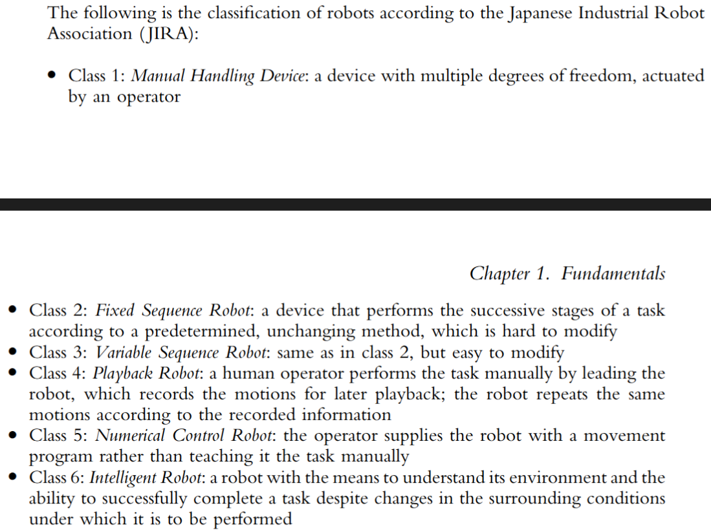

### Components 

>[sundeep:]I have altered the definitions as I see fit to be more accurate

**Manipulator** or the rover: This is the main body of the robot which consists of the links, the joints, and other structural elements of the robot

**End effector**: This part is connected to the last joint (hand) of a manipulator that generally handles objects, makes connections to other machines, or performs the required tasks (e.g a gripper or a paint spray gun)

**Actuators:** : components responsible for delivering forces and torques to the joints, thereby causing motion
of the robot.(e.g motors, pneumatic actuators, and hydraulic actuators etc.)

**Sensors** : these collect information about the robot's internal state or the outside environment

**Controller** : A controller acts as a bridge between the processor(brain of the robot) and actuators + sensors. Usually, different categories of components can have different controllers (e.g one controller for the motors , one for the camera etc.).

They in a way, offload the work from the processor , and have specialised components in them that let them directly control the said sensor or actuator.
>Attaching all these components directly to the processor would make is really complex and even non-sensical from a design perspective (working on a single controller does not require shutting down the entire robot/ its processor)

**Processor** : The processor is the brain of the robot. It calculates the motions of the
robot’s joints, determines how much and how fast each joint must move to achieve
the desired location and speeds, and oversees the coordinated actions of the controller
and the sensors. The processor is generally a computer, that requires its operating system, programs etc.

>In some systems, the controller and the processor are integrated together into one unit.
>In others, they are separate units as mentioned above.

**software**-- 

| Software Layer | Purpose | What It Does | Examples |
|---------------|-----------|--------------|----------|
| **1. Operating System (OS)** | Runs and manages the robot's computer hardware | Handles memory, processes, drivers, networking, file systems, and communication with sensors and actuators | **Ubuntu Linux**, Debian, Windows IoT, Raspberry Pi OS, Real-Time Linux (PREEMPT_RT) |
| **2. Robotics Middleware / Robot Software** | Makes the robot move and think | Computes kinematics, motion planning, localization, mapping, sensor fusion, and sends commands to controllers | **ROS 2 (Robot Operating System)**, ROS 1, MoveIt, OpenRAVE, Orocos, Gazebo integration |
| **3. Application Software** | Performs the robot's specific job | Contains task-specific logic such as navigation, object picking, inspection, warehouse operations, machine loading, assembly, or computer vision | Autonomous delivery robot software, warehouse picking systems, robotic arm assembly programs, quality inspection systems using OpenCV, drone mission software |

### Degrees of freedom

We need three variables (x,y,z) to define any point in 3D space. 
For a rigid body, along with position, we need additional 3 variables for orientation as well. 
>for orientation remember the relation between the angles from each axes-- 
$cos^2α+cos^2β+cos^2γ=1$

>knowing α and β narrows γ down to two possible values.

*The number of variables required to describe the complete state of an entity is called its degree of freedom*

e.g for the rigid body its six

Hence for robots like robotic arms to accurately place an object in a known location with the right orientation, they need to have atleast 6 degrees of freedom as well.

Having less than 6 degrees of freedom makes it impossible to do it. Having more than that requires heavy computation to find the most optimal solution to reach the desired state 

> that is something the robotics industry is struggling with right now. It is possible just not feasible enough to be used at mass.

A similar problem arises with mobile robots or robots on conveyer belt.

>the location of the base of the robot
>relative to the belt or other reference frame is known. Since this location does not need to
>be defined by the controller, the remaining number of degrees of freedom is still six, and
>consequently, unique. So long as the location of the base of the robot on the belt or the
>location of the mobile platform is known (or selected by the user), there is no need to find
>it by solving the set of equations of robot motions, and as a result, the system can
>be solved.

>> Random question I had while revising coordinate frames, may igore:

if there's a pencil. and we provide two variables for orientation. does the pencil now have infinitely many orientations bcz it can rotate indefinetely around the undefined axis or does it have only two bcz of the cosine formula.

hint: always think in frames for a rigid body. its not a simple vector, its a coordinate frame with 3 axes.

we define orientation variables in robot kinematics as rotation of the rigid body frame around an axis . Imagine trying to define i.e restrict the rotation of two axes.

### Intuitively guessing degree of freedom

e.g the human arm . 

The human arm has three joint clusters: the shoulder, the elbow, and the wrist. The shoulder has 3 degrees of freedom. The elbow has just 1 degree of freedom; it can only flex and extend about the elbow joint. The wrist also has 3 degrees of freedom. 

(ignore the robot part on the right side)

>Note: we never consider the degree of freedom in calculation of dof of a robot. e.g we didn't consider the dof of fingers for calculating dof of entire human arm.

# Fun stuff
~according to me atleast

### Robot Joints
(images from modern robotics by lynch and park)

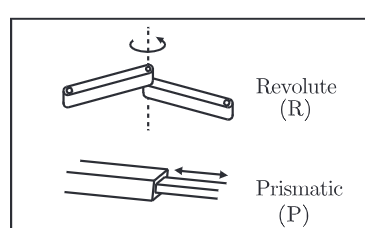

Two most basic joints -- Revolute (rotation only) , 
>although hydraulic and pneumatic rotary joints are common, most rotary joints are electrically driven, either by stepper motors or, more commonly, by servomotors.

and prismatic (linear motion only)

>they are either hydraulic or pneumatic cylinders or linear electric actuators

Using these we can create more complex joints --

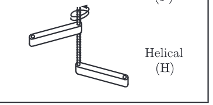

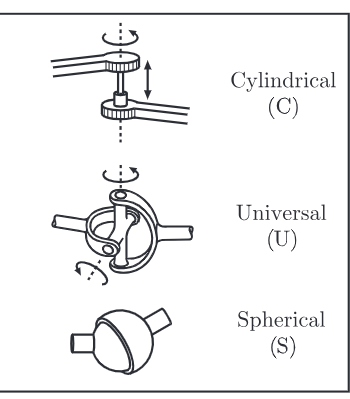

[sundeep:] I had a doubt of the distinctions between universal and spherical joints.

turns out 

Spherical joints allow full 3D rotation, whereas universal joints are specifically designed to transmit rotational power around bends, limiting rotation.

This video shows visualisations of all these different types of joints--

https://www.youtube.com/shorts/DE9nt4meeAQ

## Common robot configurations

>Prismatic joints are denoted by P, revolute joints are denoted by R, and spherical joints are denoted by S. in thhe order P, R, S

Here is the formatted Markdown version of your text. I have used a structured definition list approach paired with a clean comparative summary table to make the technical configurations easily scannable and digestible.

---

### Cartesian / Rectangular / Gantry (3P)

These robots are made of **three linear (prismatic) joints** that position the end effector. These are usually followed by additional revolute joints that orientate the end effector.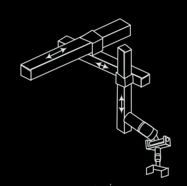

### Cylindrical (PRP)

Cylindrical coordinate robots have **two prismatic joints and one revolute joint** for positioning the part, plus extra revolute joints for orientating the part.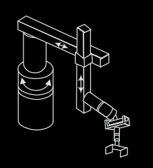

### Spherical (P2R)

Spherical coordinate robots follow a spherical coordinate system. This configuration features **one prismatic and two revolute joints** for positioning the part, plus additional revolute joints for orientation.

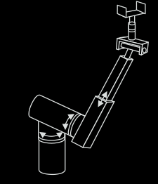

### Articulated / Anthropomorphic (3R) **

An articulated robot’s joints are **all revolute**, closely mimicking the movement of a human’s arm. They represent the most common configuration for industrial robots. 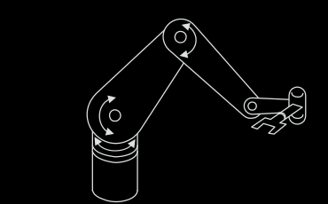

### Selective Compliance Assembly Robot Arm (SCARA) **

SCARA robots feature **two (or three) parallel revolute joints** that allow the robot to move within a horizontal plane, paired with an **additional prismatic joint** that moves vertically.

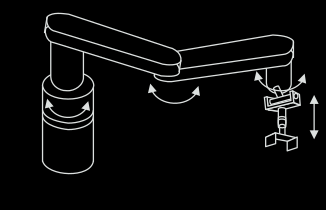

> **Key Characteristic:** SCARA robots are highly compliant in the $x$-$y$ plane but very stiff along the $z$-axis, providing specialized **selective compliance** that makes them incredibly common in assembly operations.

---

### Configuration Summary

| Robot Type | Joint Configuration | Primary Motion Type | Common Applications |
| --- | --- | --- | --- |
| **Cartesian / Gantry** | 3P (Prismatic) | Linear ($X, Y, Z$) | CNC machines, 3D printing, overhead material handling |
| **Cylindrical** | PRP | Cylindrical | Rotary assembly, coating, die-casting |
| **Spherical** | P2R | Spherical | Material handling, welding, fettling |
| **Articulated** | 3R (Revolute) | Anthropomorphic (Human-like) | Welding, painting, automotive assembly, pick-and-place |
| **SCARA** | 2R (or 3R) + 1P | Horizontal planar + Vertical | High-speed electronic assembly, pick-and-place |

## Robot Reference Frames

### World Reference Frame: 
This is a universal coordinate frame, as defined by the x-,
y-, and z-axes. In this case, the joints of the robot move simultaneously to create motion in all three axes.

`usecase`: The World reference frame is used to define the motions of the robot relative to
other objects, define other parts and machines with which the robot communicates, and
define motion trajectories.

### Joint Reference Frame: 
This is used to specify movements of individual joints of the
robot. In this case, each joint is accessed and moved individually; therefore, only one joint moves at a time. For instance, if a revolute joint
is moved, the hand will move on a circle defined by the joint axis.

### Tool Reference Frame:
The Tool Reference Frame is a coordinate system attached directly to the robot's hand (or tool/end effector). Unlike the World Frame, which stays fixed in one place, the Tool Frame moves wherever the robot's hand moves.

all motions are relative to this local n,o,a-
frame

usually

        a 
        ↑
        |
        |
      [Tool] ----→ n 
       /
      /
     o  

`usecase`: where the robot is to approach and depart from other objects or to
assemble parts.

## Pragramming Modes

Robots may be programmed in a number of different modes, depending on the robot and how sophisticated it is.

### Physical Set-up: 
In this mode, an operator sets up switches and hard stops that control the motions of the robot. This mode is usually used along with other devices such
as Programmable Logic Controllers (PLC).

### Lead Through or Teach Mode: 
In this mode, the robot’s joints are moved with a [teach pendant](https://www.google.com/search?q=teach+pendant). When the desired location and orientation is achieved, the location is entered (taught) into the controller. During playback, the controller moves the joints to the same locations and orientations. This mode is usually point-to-point; as such, the motion between points is not specified or controlled.

### Continuous Walk-Through Mode:
Entire motion is sampled and played back

### Software Mode:

Code... obviously what else

Most versatile, but time consuming.

## Common terms

### Payload: 
Payload is the weight a robot can carry and still remain within its other specifications. A robot’s maximum load capacity may be much larger than its specified payload, but at these levels, it may become less accurate.

### Reach: 
Reach is the maximum distance a robot can reach within its work envelope. 

Many points within the work envelope of the robot may be reached with
any desired orientation (called dexterous). However, for other points close to the limit of robot’s reach capability, i.e orientation cannot be specified as desired (called nondexterous point). Reach is a function of the robot’s joints and lengths and its configuration

### Precision(validity): 
Precision is defined as how accurately a specified point can be reached. 

This is a function of the resolution of the actuators as well as the robot’s feedback devices. Most industrial robots can have precision in the range of 0.001 inches or better.

The precision is a function of how many positions and orientations were used to test the robot, with what load, and at what speed.

### ** Repeatability (variability): 
Repeatability is how accurately the same position can be reached if the motion is repeated many times.

Realistically, robots reach a radius around the point, rather than the exact point due to errors.

The radius of a circle formed by the repeated motions is called repeatabil-
ity. 

Consistent erors can be predicted, and therefore, corrected through programming. However random errors can't be. //duh

Repeatability defines the extent of this random error, usually specified for a certain number of runs.

 

## Robot Workspace

The collection of points around the robot that the robot can reach, constitutes its workspace.

>The workspace may be found
mathematically by writing equations that define the robot’s links and joints and that
include their limitations such as ranges of motions for each joint.5 Alternately, the
workspace may be found empirically by virtually moving each joint through its range of
motions, combining all the space it can reach, and subtracting what it cannot reach.

approximate workspaces for cartesian, cylindrical, spherical and articulated configurations respectively
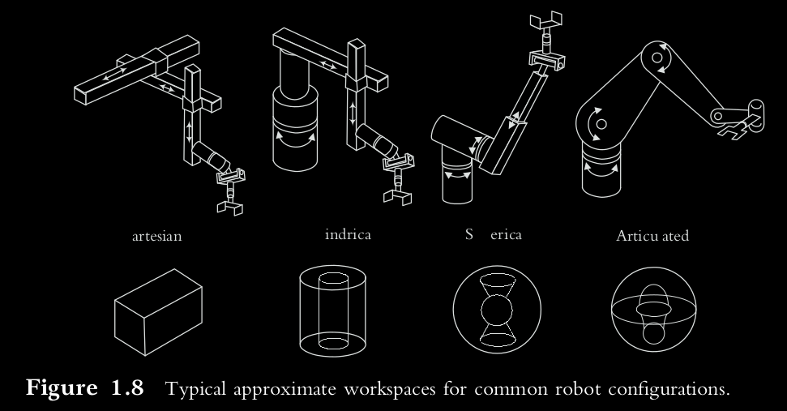

## Robot Applications

[sundeep: heart to heart convo] 

*"I believe, A robot should only perform a task that a human can not perform safely. Robots should only replace tasks that are impossible, dangerous or very repetitive for humans. Robots should especially NOT replace any creative roles"*

There's the common boring but high demand stuff like sampling, inspection, manufacturing, assembly, painting especially in the automobile industry etc.

Then there's niche but interesting stuff like surgical and other medical robots, robots to help the disabled community, hazardous study robots(eight-legged robot called Dante was to reach the lava lake of constantly erupting volcano Mount Erebus in Antarctica and study its gases), military underground mine detection robots using vibrating ultrasonic pods, underwater rescue bots , robot's for microsurgery

and the most interesting: robotics for Underwater, space, and inaccessible locations

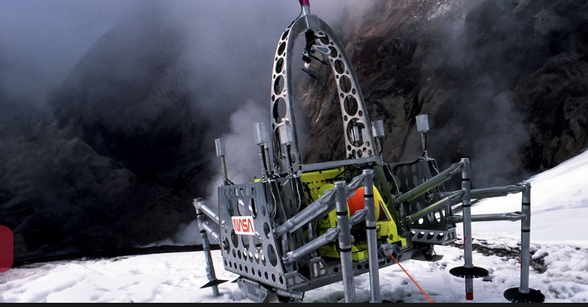

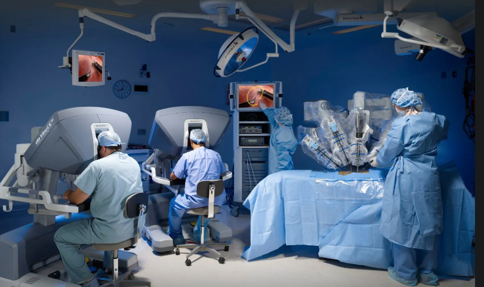

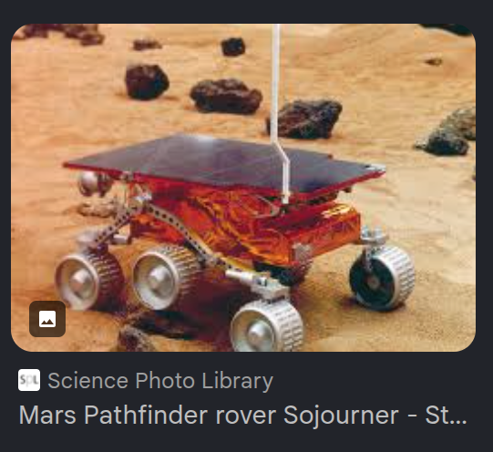

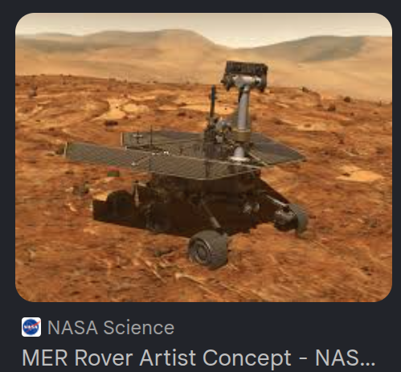 

He looks soo cutee

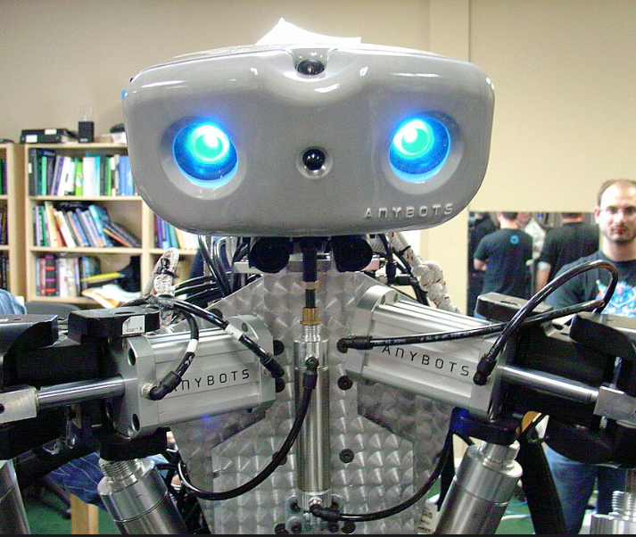

Guess his name... Monty 

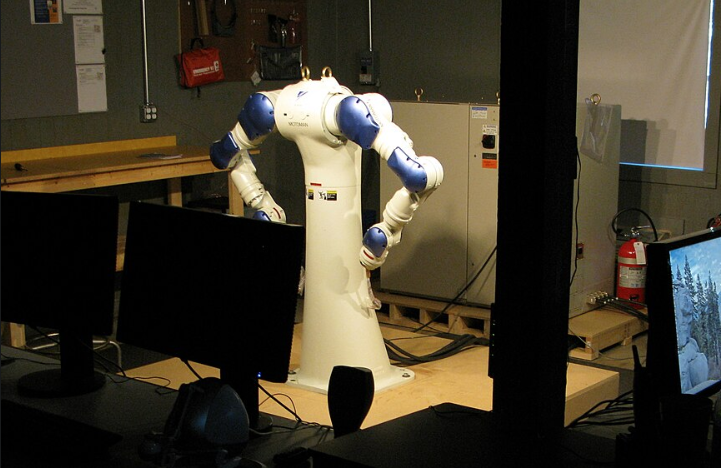

He's SDA10 dual-arm robot by Motoman, Inc. , has 15 axes of
motion. The two arms can move independently or in a coordinated manner. It can
transfer a part from one gripper to the other without the need to set it down.

[Spiderbot](http://www.technovelgy.com/CT/Science-Fiction-News.asp?NewsNum=2498#:~:text=This%20SpiderBot%20Underconst,to%20the%20ceiling.), inspired by spiderman

### Bio inspired robots

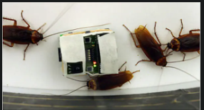

robotic roach laced with sex hormones, lured away a group of roaches in a study

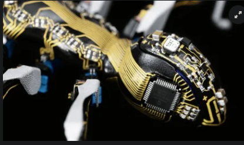

Bionic ants by festo

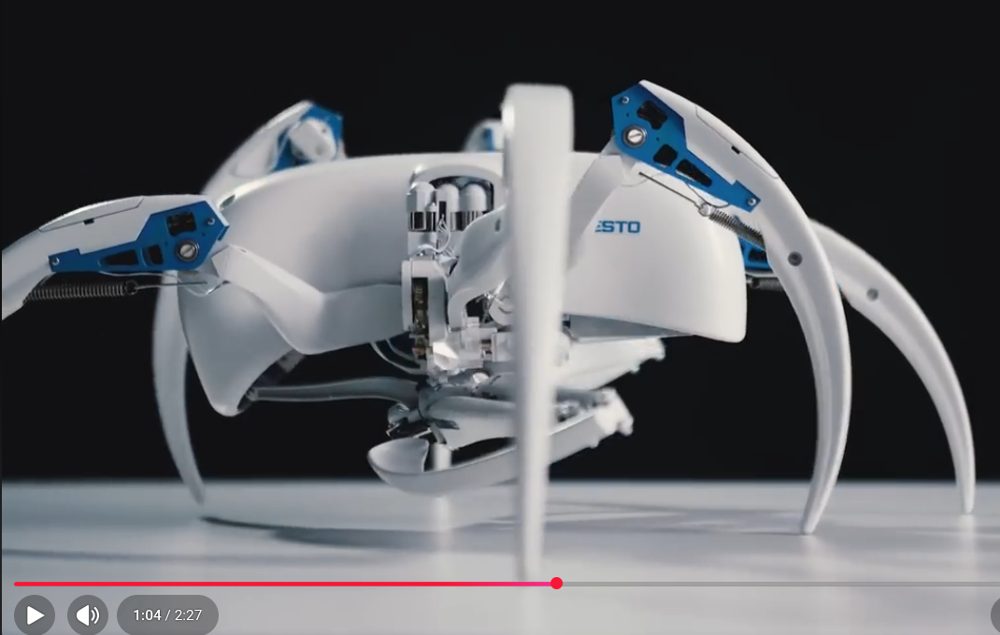

[Bionic wheel bot](https://scroll.in/video/874512/videos-bionic-insects-and-animals-made-by-this-robotics-firm-marvellously-resemble-the-real-ones) , a Moroccan flic-flac spider inspired robot that can roll as well.

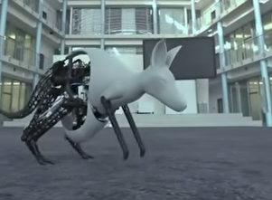

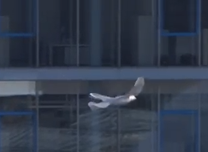

[sundeep:] I think I just found my dream company.. Festo

>And there's a few more like animatronics and MEMS(a micro-level robotic device may be sent through major veins to the heart for exploratory or
surgical functions, a MEMS sensor may be used to measure the levels of various elements in
blood, or a MEMS actuator may be used to deploy automobile airbags in a collision.)

## Questions

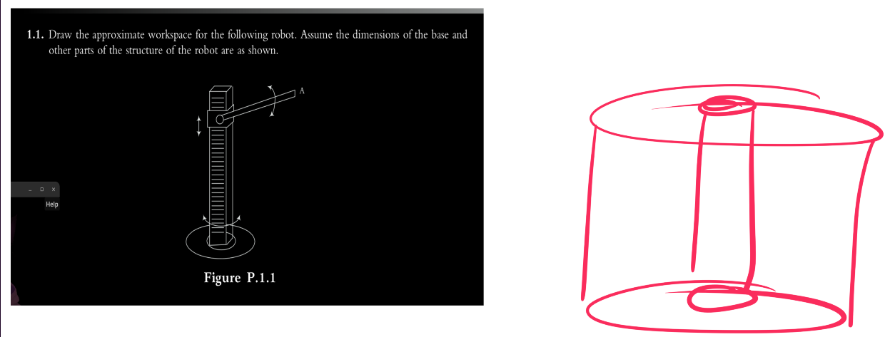

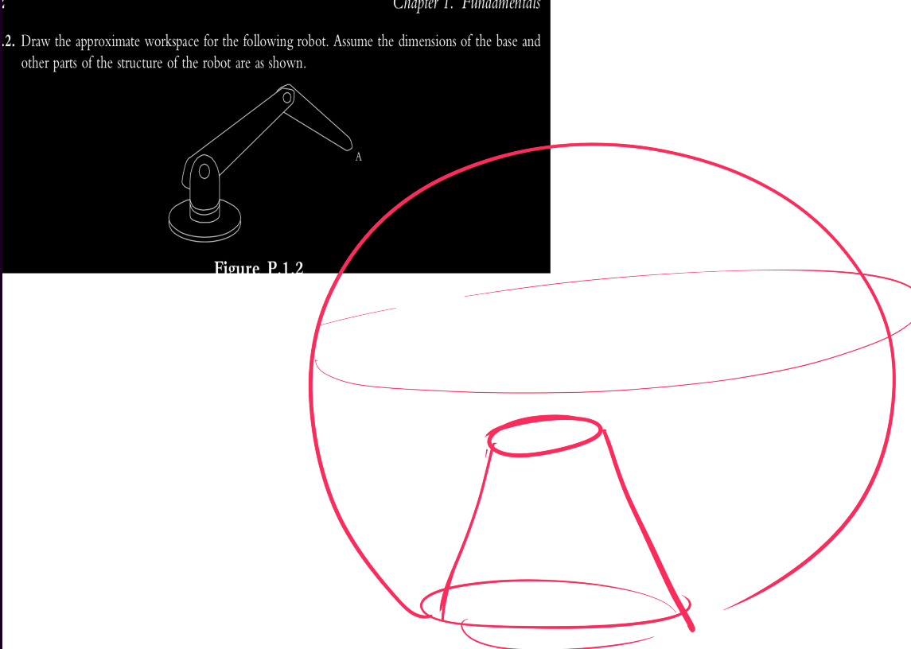

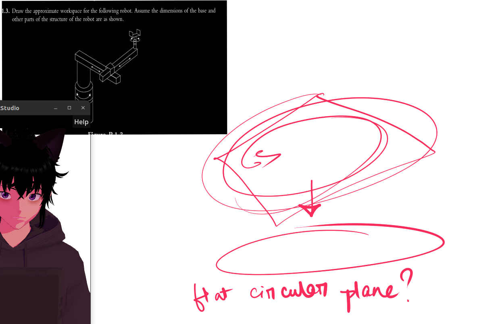

>don't mind my vtube avatar