## Common terms

### forward kinematics : 

With forwardkinematic equations, we can determine where the robot’s end (hand) will be if all joint variables are known

### Inverse kinematics :

Inverse kinematics enables us to calculate what each joint variable
must be in order to locate the hand at a particular point and a particular orientation.

### Frame:
an abstract coordinate system used to measure the position, velocity, and acceleration of objects from a specific viewpoint

### Assumptions :

Instead of the end effector, we assume a plate instead where the end effector can be attached in the future.A real robot manipulator, for which the length of the
end effector is not defined, will calculate its joint values based on the end plate location
and orientation, which may be different from the position and orientation perceived by
the user.

## Robots as mechanisms
### terms
A coupler is the floating link in a mechanism that transmits motion between the input and output links.

> In simple words, its the link not directly attached to the ground, but attached to two/more other links.

A rocker is a link that rotates about a fixed pivot but cannot complete a full 360° revolution. Instead, it oscillates between two angular limits.

### Comparing open and closed system

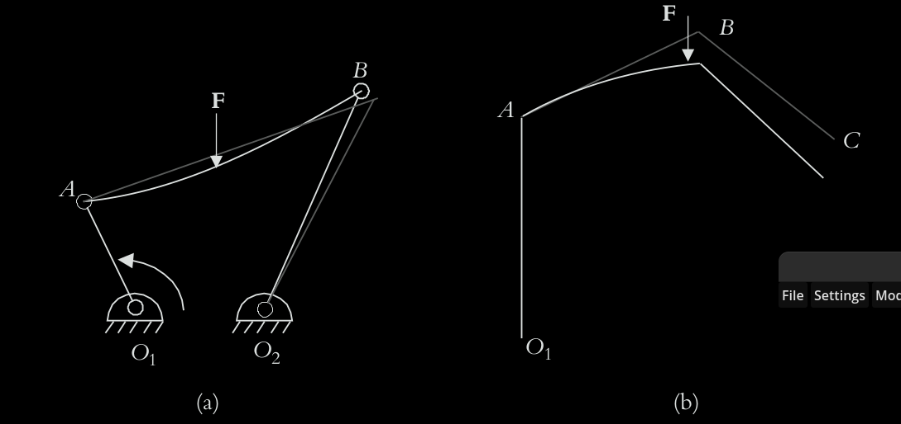

4 bar mechanism (left)
O₁A – the input crank (rotates 120° as shown)

AB – the coupler link

BO₂ – the output rocker

O₁O₂ – the fixed ground link (frame), shown implicitly as the line between the two fixed pivots

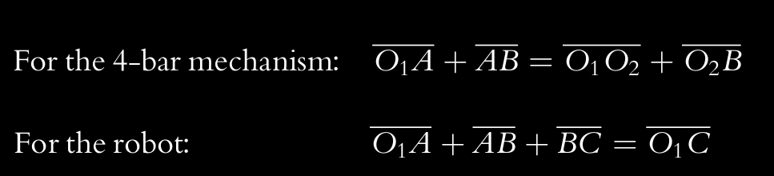

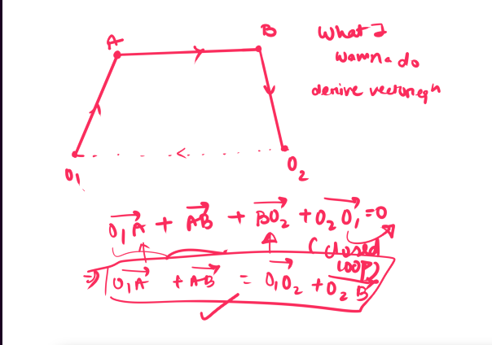

Most robots are open loop mechanisms

If link AB moves in the closed 4 bar mechanism, then the change can be calculated via the equation

However if the robot moves, then the change wont exactly be corresponding. there could be multiple configurations of the robot for a given change in link AB.

>To remedy this problem in open loop robots, either the position of the hand is
constantly measured with devices such as a camera, the robot is made into a closed loop
system with external means such as the use of secondary arms or laser beams,1,2,3 or as
standard practice, the robot links and joints are made excessively strong to eliminate all
deflections.

>Alternatives, also called parallel manipulators, are based on closed-loop parallel archi-
tecture (Figure 2.3). The tradeoff is much-reduced range of motions and workspace.

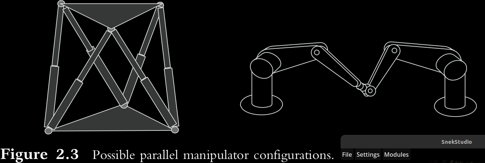

[sundeep:] I guess if you want real time operability and crazy precision without a million sensors as top priority then this is the way to go. E.g balancing plate robots

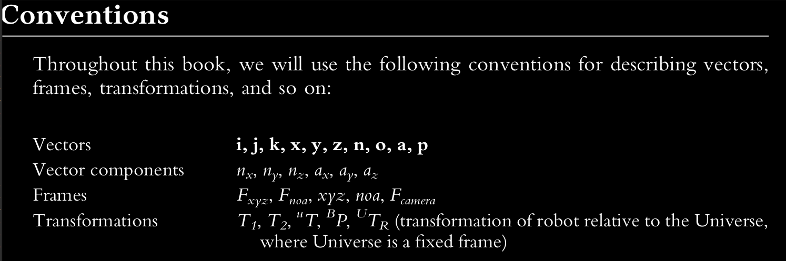

## Matrix Representations

Alternate representation of vector 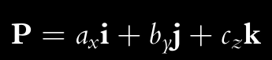
--
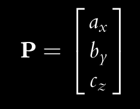 

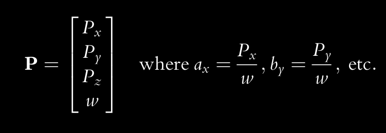, w is a scale factor

>something's wrong in the book in this part -- page 52. I think if w is smaller than the vector components becomes larger and vice versa. UNLESS he's actually talking about the components of the new vector i.e Px, Py, Pz

if w = 0,
then ax, by, and cz will be infinity

In this case - -a direction vector can be represented by a scale factor of
w = 0, where the length is not important, but the direction is represented by the
three components of the vector.

### Representation of a Frame, which is at the Origin of a Fixed Reference Frame

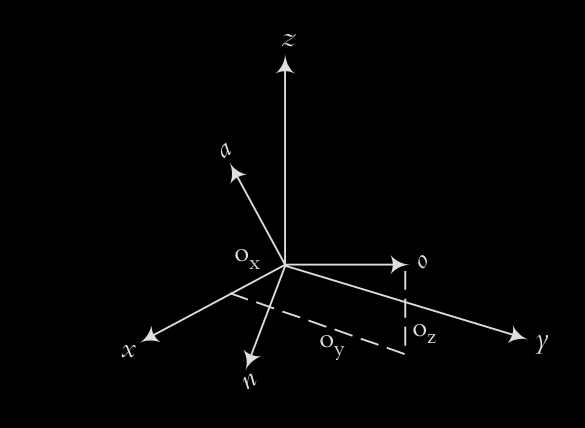
>assumptions -- we will use axes x, y, and z to
represent the fixed Universe reference frame $F x,y,z$ and a set of axes n, o, and a to represent another (moving) frame $F n,o,a$ relative to the reference frame.

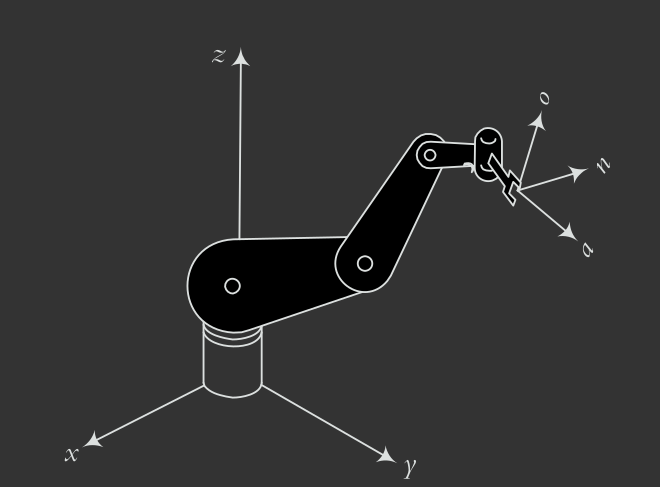

The axis along the gripper i.e the one the robot uses to approach an object to manipulate is called the approach axist(a-axis), the Oreintation-axis(o-axis) provides the orientation of the gripper and the axis normal i.e perpendicular to both is called the normal axis(n-axis).

We represent the frame  $F n,o,a$  as matrix of 3 perperndicular directional vectors [**n,o,a**] i.e 

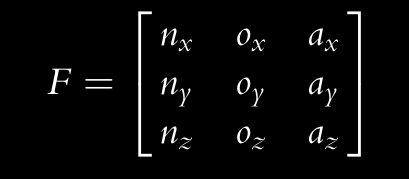

### Representation of a Frame Relative to a Fixed Reference Frame
earlier the frame in consideration was at the origin of the fixed reference frame(here the universal frame). We needed only the direction vectors  of the frame in consideration to represent it.

Now we are considering a more general case where its not at the origin. We additionally need the location of the origin of the frame in consideration as well.(relative to the fixed reference frame ofcourse.-- **p** in this case)

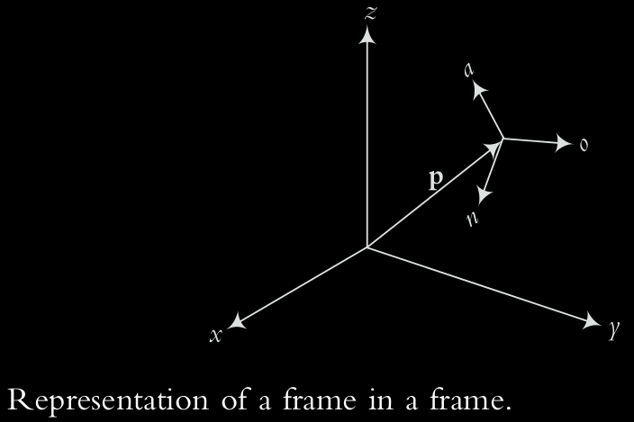

so simply the representation becomes--

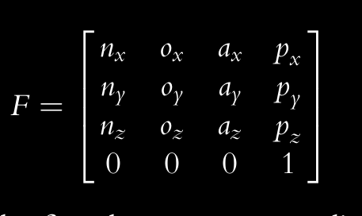

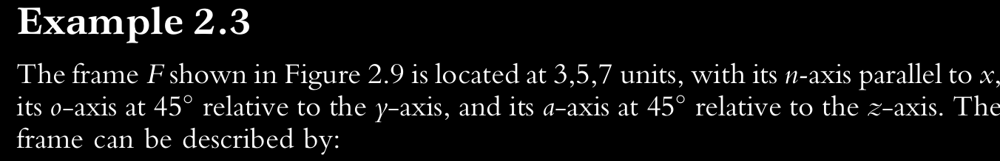
> I kinda a hard time getting the signs for example 2.3 , and then I remembered that you can move vectors without affecting their direction. try moving the vectors to the origin of the universal frame. now signs make sense according to the quadrant.  

now n is parallel to the x axis. therefore the other vectors must be locked to the xy plan and yz plane respectively

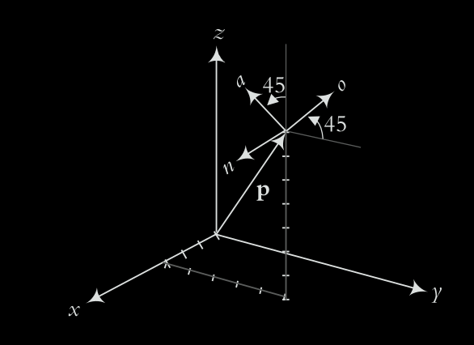

### Representation of a Rigid Body

An object can be represented in space by attaching a frame to it and representing the
frame. Since the object is permanently attached to this frame, its position and orientation
relative to the frame is always known.

>Earlier we mentioned that we need 6 pieces of information to describe a rigid body. However we are describing 12 pieces of  info in the matrix (the scaling factor doesn't add info anyway). We can boil it down to 6 using simple constraint equations -- 

how many you might wonder, let's derive that~

Suppose you start with N variables (in our case 12).-- e.g x,y,z... and so on

A constraint is a relationship between variables that makes some variables depend on others.

For example,

x+y=5

means y is no longer free once x is chosen:

y=5−x. y is replaced, meaning one variable is lost. we keep doing it for every constraint. 

therefore ,

number of independent variables = N - C

N = total variables

C = number of constraints.

In our case, its $6 = 12 - C $

therefore we need 6 constraints

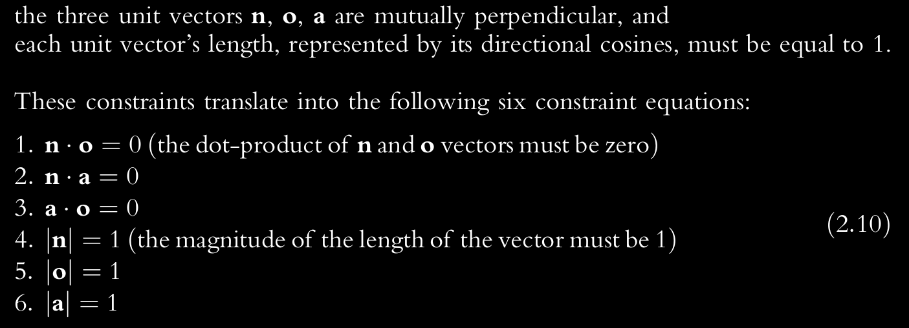

alternatively, we can replace the first three equations with a cross product 

**n** x **o** = **a** 
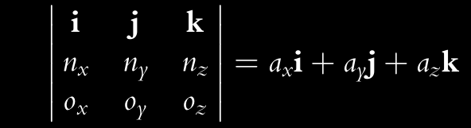

 which is the recommended method. bcz

it indicates the correct right-handed frame configuration. The scalar equation sometimes produces two or more mutually perpendicular solutions.

> for easier calculations, we tend to use homogenous matrices, e.g 4x4 or 3x3.
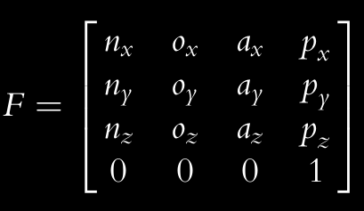
therefore even though the last row seems redundant cuz we know we'll use those scaling factors by default, We write it to make the matrix homogenous.

## Transformation matrices

A transformation is defined as making a movement in space.
- A pure translation
- A pure rotation about an axis
- A combination of translations and/or rotations

[sundeep:]

That information can be represented as a matrix T such that $M$ x $T$ = $M'$ 
>always premultiply M btw

where $M$  = original matrix

$T$ = transformation matrix

$M'$ = transformed matrix

### Pure translation
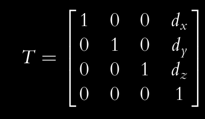

notice how that looks like an identity matrix except that the last colum thingy is different. 

dx, dy, and dz are the three components of a pure translation vector d relative to the
x-, y-, and z-axes of the reference frame.

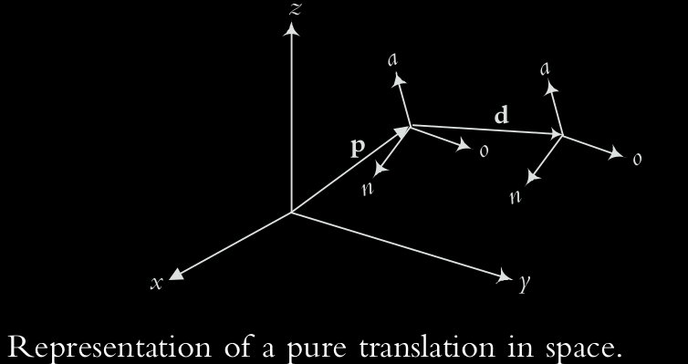

To summarise--

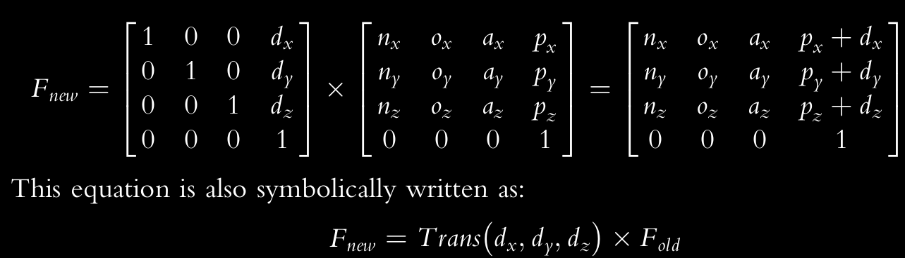

### Pure rotation

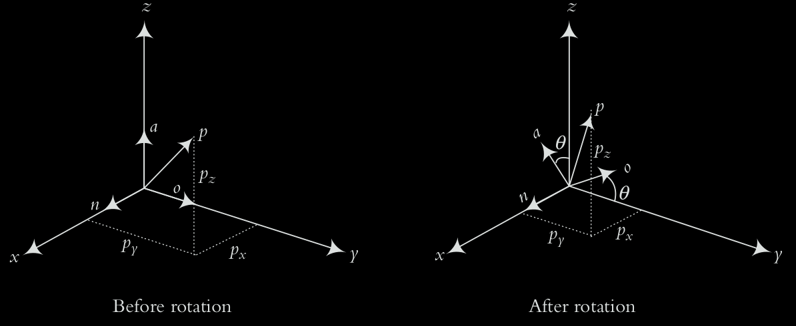

Let's assume there a point P attached to frame $F n,o,a$ .

Now if frame $F n,o,a$ is rotated by an angle $\theta$ relative to the universal frame, then the point P rotates in reference too in reference to universal frame however stays stationary to the the frame $F n,o,a$ .

We want to find the new coordinates of the
point relative to the fixed reference frame after the moving frame has rotated.

Now let’s look at the same coordinates in 2-D as if we were standing on the x-axis.
The coordinates of point p are shown before and after rotation

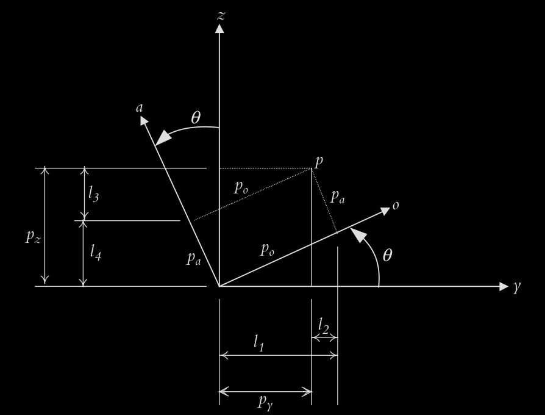

The
coordinates of point p relative to the reference frame are px, py, and pz, while its coordinates
relative to the rotating frame (to which the point is attached) remain as pn, po, and pa.

Now the with simple geometry we can conlcude some results
>look for right angles, alternate interior angles etc. should find it in a bit.

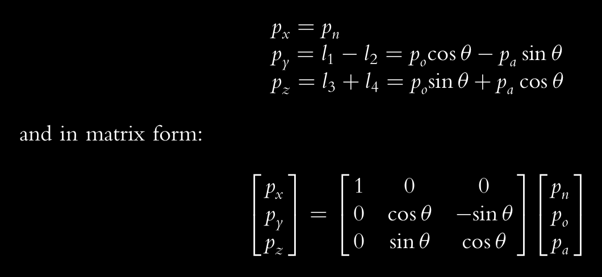

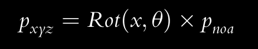
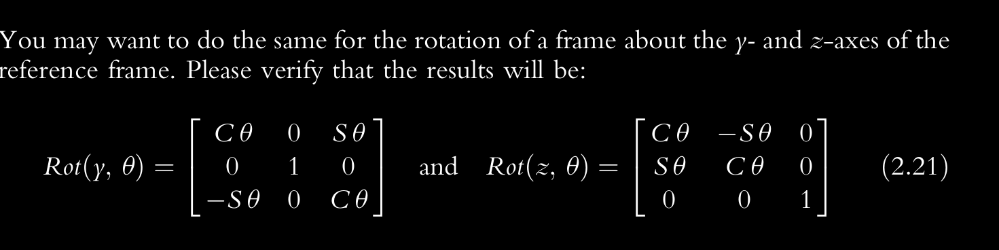

>[sundeep:]Trick to memorise this: the rotation axis doesn't change (top row for x , middle y, bottom z) i.e
$\begin{bmatrix} 1&&0&&0 \end{bmatrix}$,$\begin{bmatrix} 0&&1&&0 \end{bmatrix}$,
$\begin{bmatrix} 0&&0&&1 \end{bmatrix}$.
Now remember, rotation always happens according to the right hand rule with the thumb as the rotation axis. Take this chunk: $\begin{bmatrix} C\theta && S\theta \\ S\theta && C\theta \end{bmatrix}$ . Remember for top row is responsible for x , middle for y and bottom for z?  Now imagine your rotating the frame in 3d. If you're rotating in x, then y goes negative. For y, z goes negative and for z, x goes negative (..or you could just remember this x->y,y->z,z->x part lol) . Now whatever negative, just put a negative in its $S\theta$. fill the rest zero.

To generalise this,

we denote the transformation matrix as $^U T_R$ 
>transformation of frame R relative to frame U (for Universe)

$p_{noa}$ as $^R p$ (point p relative to frame R i.e the rotating frame)

$p_{xyz}$ as $^U p$ (point p relative to frame U i.e the universal frame)

finnally -- 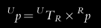

>don't forget that $^U T_R$ ,$p_{noa}$ and $p_{xyz}$ are just essentially three matrices. 

## Multiple transformations

let's take this set of tranformations --
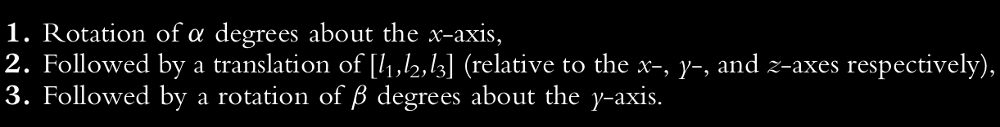

we simply keep premultiplying and calculating until the final transformation is complete.

$p_{xyz}$ =
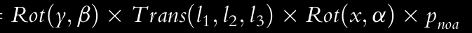

>remember 

in simple terms, the order of matrices written is the opposite of the order of transformations
performed.

## Transformations Relative to the Rotating Frame
>[sundeep:] I legitimately spent a day just a day thinking wtf is going on , at the end no LLMs helped, no videos did. Just had to frickin close my eyes and imagine all the possibilities one by one (point attached to moving frame vs universal frame, what the heck does rotate the frame about its own axis means, I thought there weren't any angles without a refrence frame, apparently I was wrong!). After testing multiple hypothesis, this is the best one I got:-

Similar situation, point p is still attached to the frame $F_{n,o,a}$ but now tranformations are doing in reference to the moving frame $F_{n,o,a}$ instead of the universal frame. What that means is that after each transform, you have to reimagine how to do the rotation/transformation.

Let's go through an example--

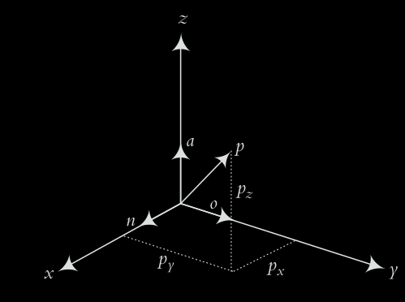
(initial state)
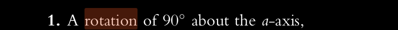
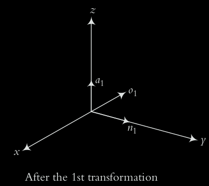
>which looks similar to rotation about z axis, bcz both of them ARE the same axes for now, duh

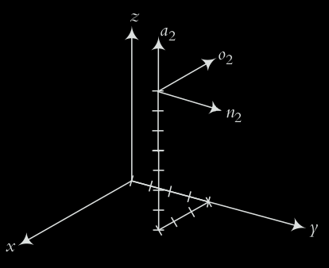
>Now we move along the n-axis wherever that is in space, similarly o and a as well. Just forget about $F_{x,y,z}$ for a sec, and move along n,o,a axes WHEREVER they are in space and whatever direction they are in. It would probably have been easier to see if the initial rotation wasn't $90 \degree$ .

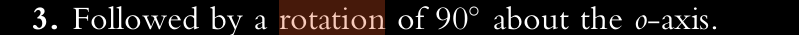
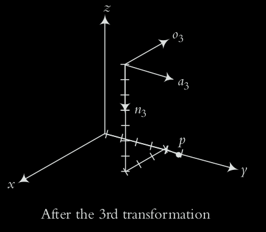
>this one should probably make sense only if you understood the previous parts

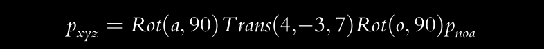

> notice, how the order of the transformation matrices being premultiplied is simply reversed

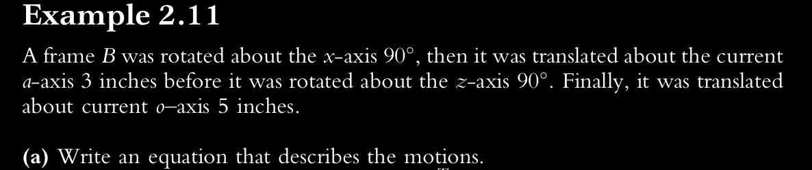
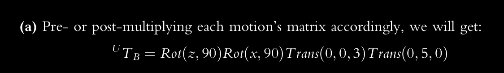
> The transformation matrices relative to the current frame are multiplied closest to the point vector, while the matrices for the universal frame are multiplied farthest(at the end of the previous group of matrices).

## Alternate transformations

The same transformations in a robot can often be achieved in more than one way--

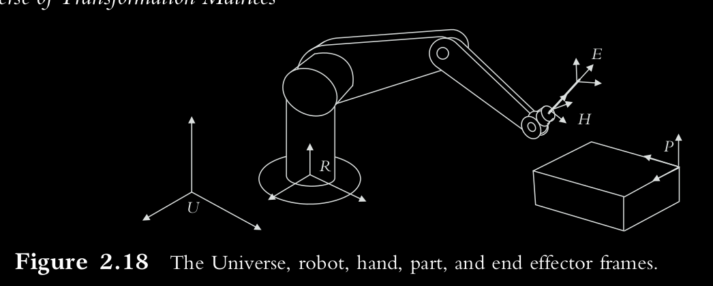
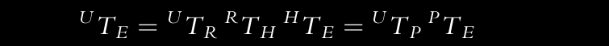

The location of point E on the part can be achieved by moving from U to P and from P
to E, or it can alternately be achieved by a transformation from U to R, from R to H, and
from H to E.