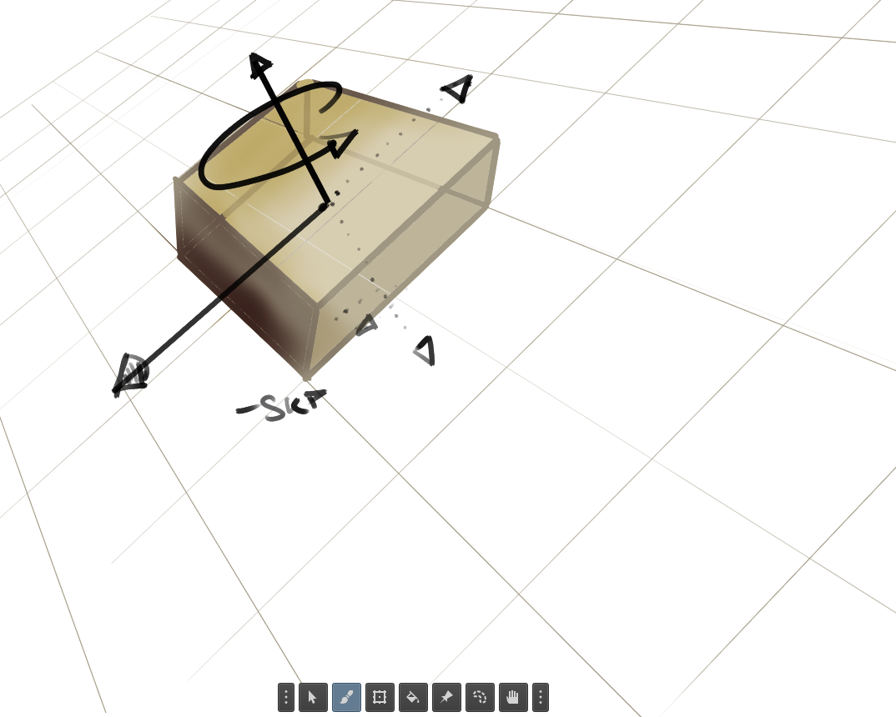
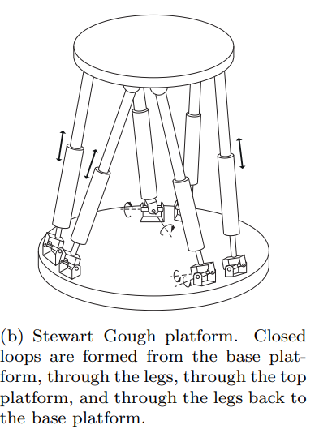

>Chapter 2 focuses on representing the configuration
of a robot system, which is a specification of the position of every point of the
robot. 

## Concept Degrees of freedom and Configuration Space
We see that the configuration of a rigid body in a fixed `plane` can be described
using three variables (two for the position and one for the orientation)
 [Sundeep: Interpretation by me]

 and the
configuration of a rigid body in `space` can be described using six variables (three
for the position and three for the orientation). The number of variables is the
number of degrees of freedom (dof) of the rigid body.
 It is also the dimension
of the `configuration space, the space(i.e set) of all configurations of the body.`
 [Sundeep: Interpretation by me]

[Sundeep:]a point on a straight line let's say y =x has 1 degree of degree. A point of a flat floor has dof =2 ; configuration is a function of 2 variables i.e f(x,y). 

similary body on a flat floor has 3 and body in space has 6 as shown in the figure drawn by me

### configuration space for point in a line-- 

A point can be at any position x on the line `q = x`

Therefore

$$
C = \{x \mid x \in \mathbb{R}\} = \mathbb{R}
$$

The configuration space is a 1-dimensional line.


### configuration space for point in a plane -- 
point can be on q = (x,y)
$$
C = \{(x,y) \mid x,y \in \mathbb{R}\} = \mathbb{R}^2
$$


For a rigid body, we need to specify both its position and orientation.

### configuration space for Rigid body in a plane--

Configuration:

q=(x,y,θ)

$$
C = \{(x,y,\theta)\mid x,y\in\mathbb{R},\ \theta\in S^1\}
= \mathbb{R}^2\times S^1
$$

> what's $S^1$?

$\theta \in 360 \degree$

```
      90°
       |
180° --+-- 0° (=360°)
       |
      270°
```

This circle is called: $S^1$
 
>I tried my best to explain this but I need contributers for a more intuitive explaination

Anyway the conclusion is similar to how the range of real numbers is called $\mathbb{R}$ , the range of angles is called $S^1$


## dof of a robot

> "The dof of a robot, and hence the dimension of its configuration space, is
> the sum of the dof of its rigid bodies minus the number of constraints on the
> motion of those rigid bodies provided by the joints"

**what do we mean by constraints?**

For example, the two most
popular joints, revolute (rotational) and prismatic (translational) joints, allow
only one motion freedom between the two bodies they connect. Therefore a
revolute or prismatic joint can be thought of as providing five constraints on
the motion of `one spatial rigid body` *relative* to `another spatial rigid body` ([sundeep:] I guess the two links i.e rigid bodies connected with the joint).

### Grubler’s formula 
used  for calculating the dof of general robot mechanisms(espeically useful when dof is non intuitive like below figure--) [will be covered in detail later --- page 36 of book, unit 2.2] 




## Topology i.e shape of configuration space
[sundeep:]
shape of configuration space let's the surface of a sphere or a flat plane, can be described either explicitly of implicitly, or even parametrically

Here's a great video explaining them -- 

https://www.youtube.com/watch?v=jZRqCfi5_Uo ~Dr. Trefor Bazett

