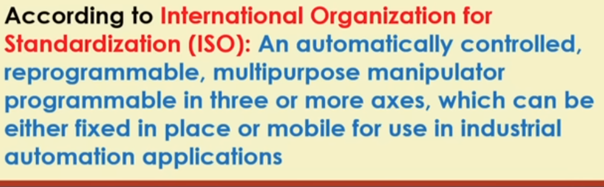
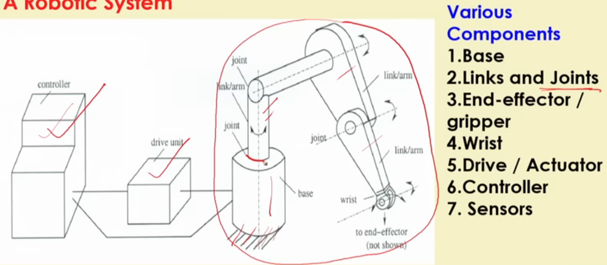

>I might rename this file. Long story short, I got scared by [the content on unit 4 husation docs](https://husarion.com/tutorials/ros2-tutorials/4-kinematics-and-visualization/), hence to build some foundational knowledge, I am reffering [robotics course by Dr. D K Pratihar](https://www.youtube.com/playlist?list=PLbRMhDVUMngcdUbBySzyzcPiFTYWr4rV_). After briefly going through the course, I realised the most I can utilise this course is pull some interview questions really . I just couldn't commit to it.

>I'll come to this file later after I finish everything else.

>There are two audio tracks in the videos [English original and hindi], use english preferrably.

## Here's everything important from the course

1. What is a robot? (possible interview question)

formal definition-- 

Note: A cnc machine is not a robot (lower level of reprogrammability)

2. What is robotics? Why is considered multidisciplinary? (possible interview question)

ans- 

Robotics is a science which deals with the issues related to design, manufacturing, usages of robots.

In robotics , we use the fundamentals of Physics, mathematics, Mechanical engg(Kinematics and dynamics), Electronics engg(Control Schemes)., Electrical Engg., Computer Sciences(Intelligent issues) etc.

3. What is a Manipulator?

A robot with a fixed base.

---

By then I realised that this course was really weird(not to disrespect him or anything I just found a more relevant course) + I couldn't find the book as pdf (hence problem with documenting)

